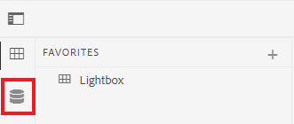
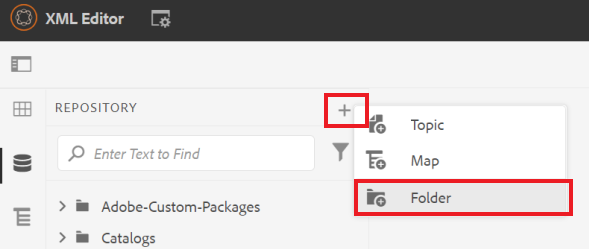
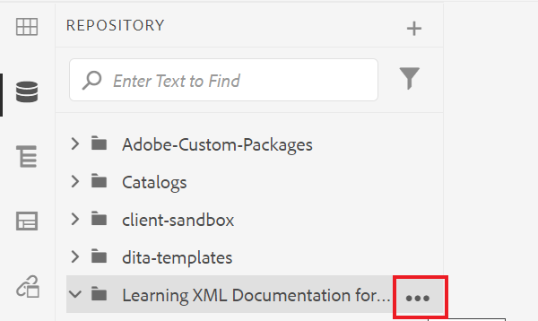
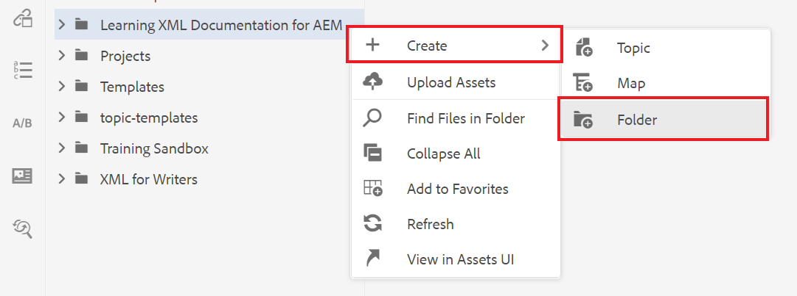
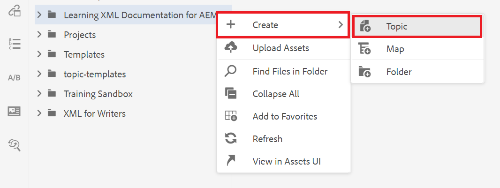
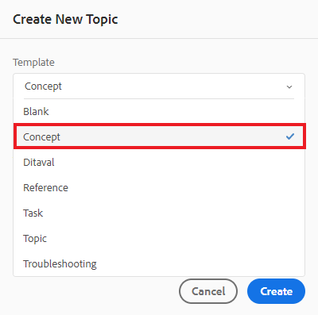
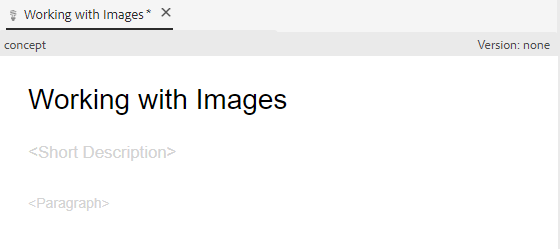

# Inhoud maken en structureren

Nadat u zich vertrouwd hebt gemaakt met de gebruikersinterface, kunt u beginnen met het maken en structureren van uw eigen inhoud.

>[!VIDEO](https://video.tv.adobe.com/v/336657?quality=12&learn=on)

## Een map maken

1. Selecteer **Bewaarplaats** pictogram om uw mappen en bestanden weer te geven.

   

1. Selecteer **+** pictogram en **Map**.

   

1. Geef de map een titel.
1. Selecteer **Maken**.
U hebt een nieuwe map gemaakt die nu wordt weergegeven in de opslagplaats. Deze map is uw thuismap voor alle cursusinhoud.

## Submappen maken

We kunnen nu een map in uw nieuwe map maken die afbeeldingen of andere inhoud bevat.

1. Houd de muisaanwijzer boven de nieuwe map in de opslagplaats en selecteer het pictogram van de ellips dat wordt weergegeven.

   

   Het menu Opties wordt weergegeven.

1. Selecteren **Map \> maken**.
   

1. Geef de submap een titel (bijvoorbeeld &quot;afbeeldingen&quot;) en selecteer **Maken**.

## Een nieuw concept maken en vullen

1. Houd de muisaanwijzer boven de bovenliggende map in de opslagplaats en selecteer het pictogram voor de ovaal.

   

   Het menu Opties wordt weergegeven.

1. Selecteren **Onderwerp \> maken**.

   

   Het dialoogvenster Nieuw onderwerp maken wordt weergegeven.

1. Selecteer in het vervolgkeuzemenu Sjabloon in het dialoogvenster de optie **Concept**.

   

1. Geef uw concept een titel en selecteer **Maken**.

   Het nieuwe concept wordt weergegeven in de editor, gevuld met de titel.

   

1. Vul het concept door in de korte beschrijving of alinea te klikken en de inhoud te typen.

## Opslaan en opslaan als nieuwe versie

U kunt uw werk op elk gewenst moment opslaan met Opslaan of Opslaan als nieuwe versie. Gebruik sparen om uw veranderingen te houden, en sparen als Nieuwe Versie te gebruiken om een nieuwe versie van uw onderwerp met huidige veranderingen tot stand te brengen.

### Uw werk opslaan zonder versioning

1. Selecteer **Opslaan** pictogram.

   

### Opslaan als een nieuwe versie

1. Selecteer **Opslaan als nieuwe versie** rechts van het pictogram Opslaan.

   

   Het dialoogvenster Opslaan als nieuwe versie wordt weergegeven.

1. Voer in het veld Opmerkingen voor nieuwe versie een korte, maar duidelijke samenvatting van de wijzigingen in.
1. Voer relevante labels in in het veld Versielabels.

   Met labels kunt u opgeven welke versie u wilt opnemen bij het publiceren.

   >[!NOTE]
   > 
   > Als uw programma met vooraf bepaalde etiketten wordt gevormd, kunt u van deze selecteren om verenigbare etikettering te verzekeren.

1. Selecteren **Opslaan**.

   U hebt een nieuwe versie van uw onderwerp gecreeerd, en het versieaantal wordt bijgewerkt.
