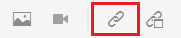
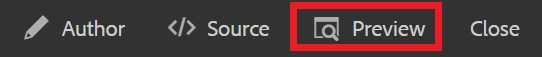
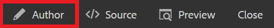

# Koppelen aan websites

Webkoppelingen leiden lezers naar websites voor meer informatie, maken interactie met externe inhoud mogelijk of geven toegang tot downloadbare bestanden. De volgende stappen gaan door hoe te om een Webverbinding aan een bestaand concept toe te voegen.

>[!VIDEO](https://video.tv.adobe.com/v/336656?quality=12&learn=on)

## Een koppeling invoegen

1. Selecteer uw concept in de opslagplaats en open het in de editor.
2. Voeg een tekenreeks aan uw concept toe en markeer deze of markeer de bestaande tekst.

   In deze gemarkeerde tekst wordt de koppeling ingevoegd.
3. Selecteer **Kruisverwijzing invoegen** op de werkbalk.

   

   Het dialoogvenster Referentie wordt weergegeven.

4. Selecteren **Webkoppeling** in het linkermenu.
5. Plak de gewenste URL en klik vervolgens op **Selecteren**.

   De koppeling is functioneel en opent een webpagina in een nieuw browsertabblad wanneer erop wordt geklikt.

## Koppelingen testen met Voorvertoning

Met de knop Voorvertoning kunt u een voorvertoning van een onderwerp weergeven. Hier kunt u uw koppelingen testen en bekijken zoals uw publiek dat zou doen.

1. Selecteren **Voorvertoning** in de bovenste zwarte menubalk.

   

   Uw concept wordt geopend in Voorvertoning.

1. Selecteer de koppeling.
Het doel van de koppeling wordt op een ander tabblad geopend.
1. Ga terug naar de weergave Auteur door **Auteur** in de bovenste zwarte menubalk.

   

## Opslaan als een nieuwe versie

Nu u meer inhoud aan uw concept hebt toegevoegd, kunt u uw werk opslaan als een nieuwe versie en uw wijzigingen opnemen.

1. Selecteer **Opslaan als nieuwe versie** pictogram.

   

1. Voer in het veld Opmerkingen voor nieuwe versie een korte, maar duidelijke samenvatting van de wijzigingen in.
1. Voer relevante labels in in het veld Versielabels.

   Met labels kunt u opgeven welke versie u wilt opnemen bij het publiceren.

   >[!NOTE]
   > 
   > Als uw programma met vooraf bepaalde etiketten wordt gevormd, kunt u van deze selecteren om verenigbare etikettering te verzekeren.

1. Selecteren **Opslaan**.

   U hebt een nieuwe versie van uw onderwerp gecreeerd, en het versieaantal wordt bijgewerkt.
