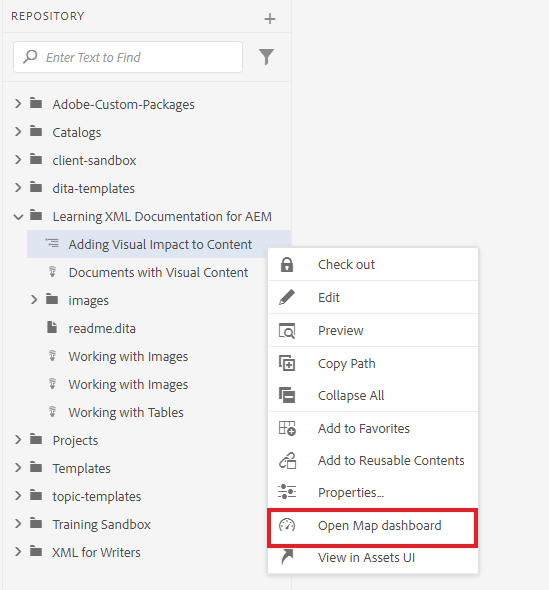
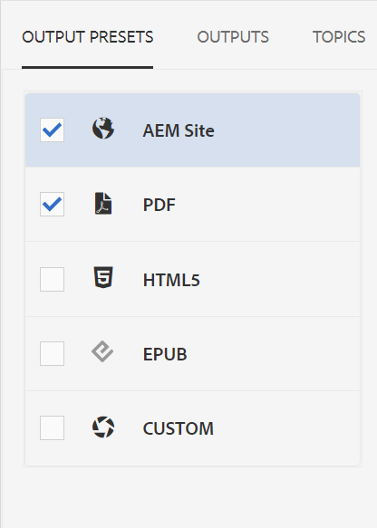
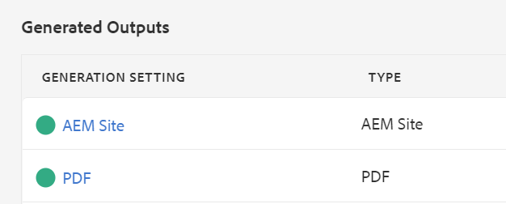

# Standaarduitvoer publiceren

Als u een voltooide kaart hebt, kunt u de inhoud publiceren in meerdere uitvoerindelingen.

>[!VIDEO](https://video.tv.adobe.com/v/336662?quality=12&learn=on)

## Uw kaart publiceren als een AEM Site en een PDF

Er zijn een aantal uitvoervoorinstellingen beschikbaar waaruit u kunt kiezen. Deze gids zal zich op de AEMUitvoer van de Plaats en van de PDF concentreren.

1. Selecteer in de opslagplaats het ellipspictogram op de kaart om het menu Opties te openen en **Openen in kaartdashboard.**

   

   Het kaartdashboard wordt op een ander tabblad geopend.

2. Selecteer AEM Site en PDF op het tabblad Voorinstellingen uitvoer.

   

3. Selecteren **Genereren.**

4. Navigeer naar de pagina Uitvoer om de status van de gegenereerde uitvoer weer te geven.

   Een groene cirkel geeft aan dat het genereren is voltooid.

   

## Uitvoer van AEM site

In de AEM site-uitvoer worden onderwerpen, lijsten, afbeeldingen, titels, tabellen en andere inhoud die met de XML-editor zijn gemaakt, automatisch naar webvriendelijke inhoud gepubliceerd AEM.

U kunt ondergeschikte onderwerpen in de inhoudstafel evenals in de Verwante informatiesectie zien. Deze koppelingen kunnen allemaal worden gebruikt om te navigeren.

## De PDF-uitvoer

Het voltooide PDF-document bevat de standaardtitel van de kaart als de hoofdtitel op de omslagpagina. De pagina&#39;s van de omslag van het hoofdstuk worden gestileerd met het hoofdstukaantal, en bevatten verbindingen aan de onderwerpen binnen.
