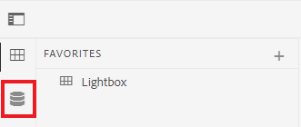

# De AEM gebruikersinterface

Leer over het beheren van activa, dossiers, en omslagen in de Redacteur van XML voor Experience Manager.

>[!VIDEO](https://video.tv.adobe.com/v/336659?quality=12&learn=on)

## De XML-editor openen

1. Voer in het aanmeldingsscherm uw gebruikersnaam en wachtwoord in en selecteer **[!UICONTROL Sign In]**.
2. Selecteren **[!UICONTROL XML Editor]** op de AEM navigatiepagina.

## Weergaven van XML-editor

Vanuit het zijpaneel kunt u kiezen uit meerdere weergaven voor de XML-editor om aan uw organisatorische behoeften te voldoen. Dit zijn de standaardweergave en [!UICONTROL Repository View].

In de standaardweergave worden uw [!UICONTROL Favorites]. U kunt deze desgewenst verder aanpassen met sneltoetsen. Omgekeerd worden de [!UICONTROL Repository View] geeft een meer traditionele mapstructuur weer.

### Schakelen naar de [!UICONTROL Repository View] in de standaardweergave

1. Selecteer in het linkerspoor **[!UICONTROL Repository View]**.

   

   De [!UICONTROL Repository View] worden weergegeven.

## De interface Middelen

In de [!UICONTROL Assets] interface, kunt u bekijken

### Inhoud weergeven in de interface Middelen

U kunt aanvullende acties uitvoeren met uw inhoud. Een van deze opties is om uw bestand weer te geven in de interface Elementen.

1. Houd de muisaanwijzer boven een map of onderwerp in de opslagplaats en selecteer het pictogram van de ellips dat wordt weergegeven.

   

   Het menu Opties wordt weergegeven.

1. Selecteer in het menu **Weergeven in interface Elementen.**

   

### Een weergave selecteren

U kunt kiezen uit meerdere weergaven voor de interface Middelen om aan uw organisatorische behoeften te voldoen.

1. Selecteer **Weergaveswitter** in de rechterbovenhoek.

   

   Er wordt een vervolgkeuzemenu weergegeven.

1. Selecteer de weergave waarmee u wilt werken.

### Weergaven gebruikersinterface voor elementen

| Naam | Beschrijving |
| --- | --- |
| Kaartweergave | Elk element als pictogram weergeven |
| Kolomweergave | Geeft elementen weer in een versmalde, uitbreidbare mapstructuur |
| Lijstweergave | Geeft elementen in een lijst weer, samen met de details ervan |

## Terugkeren naar de XML-editor

U kunt vanuit elke weergave van de interface Elementen terugkeren naar de XML-editor.

### Terugkeren uit lijst- en kolomweergave

1. Selecteer het onderwerp u van de lijst wilt uitgeven.
Het onderwerp toont in Elementen UI.
2. Selecteren **Bewerken** in de bovenste werkbalk.
U gaat terug naar de XML-editor.

### Kaartweergave herstellen

1. Selecteer het potloodpictogram op een onderwerp in het dialoogvenster [!UICONTROL Assets] UI.

   

   U gaat terug naar de XML-editor.
