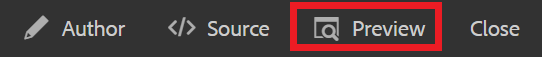

# Versioning-inhoud

Als u een document versibreert, wordt een opname van de huidige staat gemaakt. Het creëren van veelvoudige versies van een onderwerp of kaart staat u toe om spoor van uw veranderingen te houden en ouder werk terug te krijgen.

>[!VIDEO](https://video.tv.adobe.com/v/336724?quality=12&learn=on)

## Een nieuwe versie maken

1. Selecteer het pictogram Opslaan als nieuwe versie.

   

   Het dialoogvenster Opslaan als nieuwe versie wordt weergegeven.

1. Voer in het veld Opmerkingen voor nieuwe versie een korte, maar duidelijke samenvatting van de wijzigingen in.
1. Voer relevante labels in in het veld Versielabels.

   Met labels kunt u opgeven welke versie u wilt opnemen bij het publiceren.

   >[!NOTE]
   > 
   > Als uw programma met vooraf bepaalde etiketten wordt gevormd, kunt u van deze selecteren om verenigbare etikettering te verzekeren.
1. Selecteren **Opslaan**.

   U hebt een nieuwe versie van uw onderwerp gecreeerd, en het versieaantal wordt bijgewerkt. De eerste versie van een document is versie 1.0.

## Versiehistorie weergeven

Als u meerdere versies van uw inhoud hebt, kunt u de verschillen tussen de versies onderzoeken.

1. Selecteer het pictogram Versiehistorie op de werkbalk.

   

   Het dialoogvenster Versiehistorie wordt weergegeven.

1. Selecteer een versie in het vervolgkeuzemenu waarin u de huidige versie wilt vergelijken.

   Wijzigingen van versie tot versie worden aangegeven.

## Terugkeren naar een geselecteerde versie

Indien nodig, kunt u een versie selecteren en terugkeren naar de versie. Hierdoor kunt u de huidige versie negeren en terugkeren naar het werken met een eerdere versie.

1. Selecteer in het dialoogvenster Versiegeschiedenis de versie waarnaar u wilt terugkeren in het vervolgkeuzemenu.
1. Selecteren **Geselecteerde versie herstellen**.

Het dialoogvenster Versie herstellen wordt weergegeven.

1. Voeg een beschrijvende opmerking toe over de reden waarom u terugkeert naar een vorige versie.
1. Selecteren **Bevestigen**.

   Uw onderwerp is teruggegaan naar de specifieke versie.

## Filters gebruiken om versies te vergelijken

U kunt versieverschillen in Voorvertoning ook bekijken met de filters Tekstspatiëring en Afloopgebied tonen in de rechterrails.

1. Selecteren **Voorvertoning** in de bovenste menubalk.

   

   Uw onderwerp wordt geopend in Voorvertoning.

1. Selecteer in het vervolgkeuzemenu Tekstspatiëring op de rechtertrack de optie **Markering tonen**.
1. Selecteer in het vervolgkeuzemenu Diff tonen de versie waarmee u wilt vergelijken.

   Uw wijzigingen worden weergegeven als opgemaakte inhoud.
