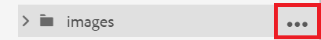

# Werken met afbeeldingen

Het volgende zal u door het uploaden van en het opnemen van een beeld, evenals hoe te om een nieuwe versie van een onderwerp te bewaren.

U kunt het afbeeldingsbestand met het voorbeeld downloaden van [hier.](assets/working-with-images/SignInScreen.png)

>[!VIDEO](https://video.tv.adobe.com/v/336661?quality=12&learn=on)

## Een afbeelding uploaden

1. Houd de muisaanwijzer boven de submap en selecteer het pictogram van de ovaal om het menu Opties te openen.

   

1. Selecteer **[!UICONTROL Upload Assets]**.

   

1. Selecteer de afbeelding die u wilt uploaden van uw lokale systeem en selecteer **Openen**.

   De [!UICONTROL Upload Assets] wordt weergegeven.
1. Selecteren **Uploaden**.

## Een afbeelding invoegen in een onderwerp

Er zijn veelvoudige manieren om een beeld in uw onderwerp op te nemen.

U kunt een afbeelding van uw lokale systeem naar het onderwerp slepen. Als de afbeelding al is geüpload, kunt u deze ook rechtstreeks vanuit de linkertrack naar het onderwerp slepen. U kunt ook de knop Afbeelding invoegen gebruiken om afbeeldingen in te voegen die momenteel niet zichtbaar zijn in de linkerrails en om de afbeelding verder te configureren voordat u deze invoegt.

Voor het volgende, zorg ervoor dat uw onderwerp in de documentredacteur open is.

### Een afbeelding invoegen met slepen en neerzetten

1. Selecteer het afbeeldingsbestand in uw lokale systeem of in de linkerrail en sleep het naar het onderwerp.

   De afbeelding wordt weergegeven in de editor.

### Een afbeelding invoegen met de knop Afbeelding invoegen

1. Selecteer **Afbeelding invoegen** pictogram.

   

   Het dialoogvenster Afbeelding invoegen wordt geopend.

1. Selecteer het mappictogram naast het veld Bestand selecteren om naar de afbeelding te zoeken of naar de locatie in de opslagplaats te navigeren.
1. Selecteer het pictogram van de afbeelding en klik vervolgens op **Selecteren**.

   

   Het dialoogvenster Afbeelding invoegen wordt weergegeven met de informatie van de gekozen afbeelding.

1. Typ desgewenst tekst in de velden Figuurtitel en Alternatieve tekst.
1. Selecteren **Invoegen**.

   De afbeelding wordt samen met de titel van de figuur weergegeven in de editor.

## Een afbeelding uit een onderwerp verwijderen

1. Selecteer de afbeelding in de documenteditor en druk op de knop **Verwijderen** toets.

## Een nieuwe versie van een onderwerp opslaan

Met Versioning kunt u verschillende versies controleren en vergelijken. U kunt zelfs terugdraaien naar een vorige versie.

Aangezien u een significante verandering in uw onderwerp hebt aangebracht, kunt u het nu nuttig vinden om uw huidig werk als nieuwe versie te bewaren.

1. Selecteer **Opslaan als nieuwe versie** pictogram.

   

   De **Opslaan als nieuwe versie** wordt weergegeven.

1. Voer in het veld Opmerkingen voor nieuwe versie een korte, maar duidelijke samenvatting van de wijzigingen in.
1. Voer relevante labels in in het veld Versielabels.

   Met labels kunt u opgeven welke versie u wilt opnemen bij het publiceren.
   >[!NOTE]
   > 
   > Als uw programma met vooraf bepaalde etiketten wordt gevormd, kunt u van deze selecteren om verenigbare etikettering te verzekeren.
1. Selecteren **Opslaan**.

   U hebt een nieuwe versie van uw onderwerp gecreeerd, en het versieaantal wordt bijgewerkt.
