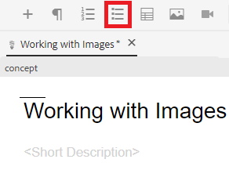
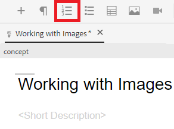

# Werken met lijsten

U kunt genummerde lijsten met opsommingstekens en nummers nodig hebben om uw gegevens in te delen. Het volgende zal u op hoe te om met lijsten binnen een bestaand concept op te nemen en te werken instrueren.

>[!VIDEO](https://video.tv.adobe.com/v/336658?quality=12&learn=on)

## Lijsten met opsommingstekens

Een lijst met opsommingstekens of zonder volgorde moet worden gebruikt wanneer onderdelen van een lijst niet in een bepaalde volgorde hoeven te worden gerangschikt.

### Een lijst met opsommingstekens invoegen

1. Selecteer **Lijst met opsommingstekens invoegen** op de werkbalk.

   

   Er wordt een opsommingsteken weergegeven. Dit is het begin van je lijst.

1. Typ het eerste lijstitem.
1. Druk op Enter om een tweede item te maken en typ uw inhoud.
1. Voeg zo nodig lijstitems toe.

## Genummerde lijsten

Een genummerde lijst moet worden gebruikt wanneer lijstonderdelen op een bepaalde manier moeten worden geordend of gestructureerd.

### Een geordende lijst invoegen

1. Selecteer **Genummerde lijst invoegen** op de werkbalk.

   

   Er wordt een getal weergegeven. Dit is het begin van je lijst.

1. Typ het eerste lijstitem.
1. Druk op Enter om een tweede item te maken en typ uw inhoud.
1. Voeg zo nodig lijstitems toe.

## Opslaan als een nieuwe versie

Nu u meer inhoud aan uw concept hebt toegevoegd, kunt u uw werk opslaan als een nieuwe versie en uw wijzigingen opnemen.

1. Selecteer **Opslaan als nieuwe versie** pictogram.

   

1. Voer in het veld Opmerkingen voor nieuwe versie een korte, maar duidelijke samenvatting van de wijzigingen in.
1. Voer relevante labels in in het veld Versielabels.

   Met labels kunt u opgeven welke versie u wilt opnemen bij het publiceren.

   >[!NOTE]
   > 
   > Als uw programma met vooraf bepaalde etiketten wordt gevormd, kunt u van deze selecteren om verenigbare etikettering te verzekeren.

1. Selecteren **Opslaan**.

   U hebt een nieuwe versie van uw onderwerp gecreeerd, en het versieaantal wordt bijgewerkt.
