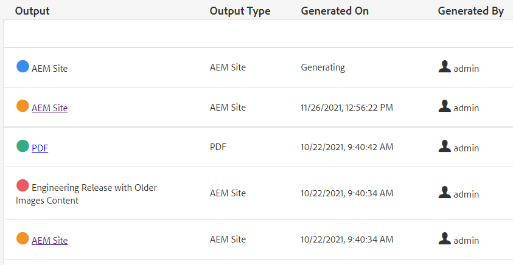

# Bulkpublicatie

Bij het publiceren is vaak meer dan één type documentatie nodig. Met Kaartverzamelingen kunt u het aantal en de typen uitvoer bepalen die worden samengesteld en gegenereerd en kunt u het publiceren in bulk starten. Met het dashboard Publiceren kunt u actieve publicatietaken weergeven. Met het dashboard voor bulksgewijs publiceren kunt u verzamelingen bulksgewijs activeren.

>[!VIDEO](https://video.tv.adobe.com/v/338985?quality=12&learn=on)

## Werken met kaartverzamelingen

Gebruikend de Inzamelingen van de Kaart, kunt u de types van output controleren die voor één of meerdere kaart zal worden geproduceerd.

### Kaartverzamelingen maken

1. Klik in het menu Navigatie op **Activa**.

2. Selecteer Verzamelingen toewijzen.

3. Klikken **Maken**.

4. Typ een titel voor een verzameling.

   

5. Klikken **Maken**.
6. Sluit het succesbericht.

7. Open de kaartverzameling (klik op de grijze sectie onder de tegel)

8. Klikken **Bewerken**.

9. Voeg zo nodig kaarten toe.

10. Selecteren of deselecteren **Voorinstellingen uitvoer** voor elke kaart.

11. Klikken **Gereed**.

### Voorinstellingen voor toewijzingen filteren

1. Open een kaartvoorinstelling.

2. Onder **Filter** naar wens opties uitvouwen en selecteren.

### Inhoud genereren in een kaartverzameling

1. Open een kaartvoorinstelling.

2. Klik desgewenst op **Alles genereren**.

3. OF, selecteer de kaarten en outputtypes om te produceren en te klikken **Geselecteerde genereren**.

4. Schakel indien nodig over naar het tabblad Uitvoer.

5. Controleer de uitvoer.

## Actieve publicatietaken weergeven op het dashboard Publiceren

Met het dashboard Publiceren kunt u actieve publicatietaken weergeven. Er wordt een dynamische lijst met kaarten en hun huidige status weergegeven. U kunt publicatieworkflows bijhouden, beheren of annuleren.

1. Klik in de navigatieweergave op de knop **Gereedschappen** pictogram.

2. Klik op **[!DNL Guides]**.

3. Selecteer **Dashboard publiceren** tegel.

       Als het dashboard leeg is, worden er geen publicatietaken uitgevoerd.
       
   
4. Filter zo nodig het dashboard om alle publicatietaken weer te geven.

### Werken met het dashboard voor bulkpublicatie

Met het bulkpublicatiedashboard kunt u werken met Bulk Activation Collections en meerdere typen uitvoer beheren.

### Een bulkactiveringsverzameling maken

1. Klik in de navigatieweergave op de knop **Gereedschappen** pictogram.

2. Klik op **[!DNL Guides]**.

3. Selecteer **Bulk publicatiedashboard** tegel.

4. Typ een titel voor een verzameling.

5. Klikken **Maken**.

6. Klikken **Openen**.

7. Open de kaartverzameling (klik op de grijze sectie onder de tegel)

8. Klikken **Bewerken**.

9. Voeg zo nodig kaarten toe.

10. Selecteren of deselecteren **Voorinstellingen uitvoer** voor elke kaart.

11. Klikken **Gereed**.

12. Sluit de kaartafbeelding wanneer u klaar bent.

### Snelle publicatie van een verzameling bulkactivering

1. Selecteer een tegel voor de verzameling van bulkactiveringen.

2. Klikken **Openen**.

3. Selecteer een of meer kaarten.

4. Klikken **Snel publiceren**.
