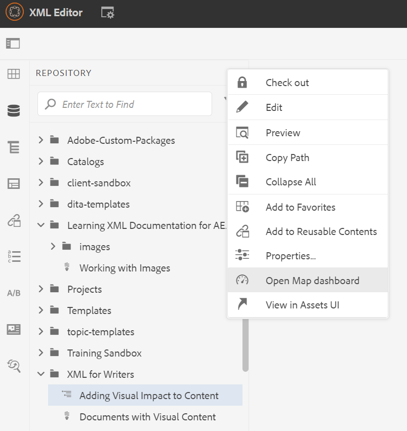
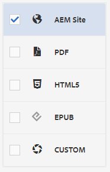
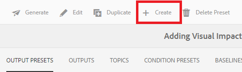

# Maken en publiceren met basislijnen

Door een basislijn te gebruiken, kunt u een versie van uw kaartonderwerpen en verwante verwijzingsinhoud maken. Dit kan op een specifieke datum of tijd, of etiketten worden gebaseerd.

>[!VIDEO](https://video.tv.adobe.com/v/338993?quality=12&learn=on)

## Toegang tot het tabblad Basislijnen op het dashboard Kaart

U kunt tot uw basislijnen in het Dashboard van de Kaart toegang hebben.

1. Weergave opslagplaats, selecteer het pictogram Ovaal op de kaart om het menu Opties te openen en vervolgens **Open Kaartdashboard.**

   
Het kaartdashboard wordt op een ander tabblad geopend.

2. Selecteren **Basislijnen**.

   

Het tabblad Basislijnen wordt weergegeven.

## Een basislijn maken op basis van labels

1. Selecteer op het tabblad Basislijnen de optie **Maken**.

   

   De nieuwe basislijninformatie wordt weergegeven. De standaardnaam is gebaseerd op de aanmaakdatum.

2. Geef uw basislijn een nieuwe naam, indien nodig.

3. Selecteer onder de kop &quot;De versie instellen op basis van&quot; de cirkel bij Label.
   

   >[!NOTE]
   >
   >OPMERKING: De *Laatste versie gebruiken als label niet aanwezig is* selectievakje is standaard ingeschakeld. Als dit niet wordt geselecteerd, en onderwerpen of media dossiers zonder het gekozen etiket op uw kaart bestaan, zal het proces van de verwezenlijking van de Basislijn ontbreken.

4. Voer het label in dat u wilt gebruiken.

5. Selecteren **Opslaan**.

De basislijn wordt gemaakt. Een lijst van alle onderwerpen en hun bijbehorende informatievertoningen.

### De functie Bladeren door alle onderwerpen gebruiken

De Browse Al eigenschap van Onderwerpen staat u toe om de informatie van het onderwerp, met inbegrip van de versie en het etiket te bekijken, evenals de gebruikte versie te specificeren. U kunt het openen door te selecteren **Bladeren door alle onderwerpen** bij het maken of bewerken van de basislijn.

## Een basislijn maken op basis van datum en tijd

U kunt ook basislijnen maken die een momentopname in de tijd zijn.

1. Zorg ervoor dat het tabblad Basislijnen is geopend en selecteer Maken.

   

2. Selecteer onder de kop &quot;De versie instellen op basis van&quot; de cirkel bij &quot;Versie ingeschakeld&quot;.

   

3. Selecteer het kalenderpictogram en geef de gewenste datum en tijd op.

   

4. Geef uw basislijn een nieuwe naam als dat nodig is.

5. Selecteren **Opslaan**.

De basislijn wordt gemaakt. Een lijst van alle onderwerpen en hun bijbehorende informatievertoningen.

### Labels toevoegen aan de basislijn

U kunt een nieuw label in bulk aan al uw kaartinhoud willen toewijzen.

1. Selecteer de basislijn waaraan u labels wilt toevoegen.

2. Selecteren **Labels toevoegen**.

   

   Het dialoogvenster Label toevoegen wordt weergegeven.

3. Voer het label in dat u wilt toewijzen en selecteer **Toevoegen**.

Het label is toegevoegd aan alle onderwerpen.

## Een AEM Site-uitvoer genereren met een basislijn

1. Navigeer naar het tabblad Uitvoervoorinstellingen in het dashboard Kaart.

2. Schakel het selectievakje AEM site in.

   

3. Selecteren **Bewerken**.

   

   Er wordt een nieuwe pagina weergegeven.

4. Schakel het selectievakje Basislijn gebruiken in en kies in het vervolgkeuzemenu de basislijn die u wilt gebruiken.

   

5. Selecteren **Gereed**.

   

6. Selecteren **Genereren**.

   

   De uitvoer is gegenereerd met een basislijn.

## De gegenereerde uitvoer weergeven

1. Navigeer naar het tabblad Uitvoer in het kaartdashboard.

2. Selecteer de tekst in de kolom Generatie-instelling om de uitvoer te openen.
   

## Een basislijn verwijderen

1. Selecteer op het tabblad Basislijnen de basislijn die u wilt verwijderen.

2. Selecteren **Verwijderen**.

   

   Het dialoogvenster Basislijn verwijderen wordt weergegeven.

3. Selecteren **Verwijderen**.

De basislijn wordt verwijderd.

## Een basislijn dupliceren

1. Selecteer op het tabblad Basislijnen de basislijn die u wilt dupliceren.

2. Selecteren **Dupliceren**.

   

3. Selecteren **Opslaan**.

   

De gedupliceerde basislijn wordt gemaakt.

## Een basislijn wijzigen

U kunt de versie van een onderwerp direct specificeren dat in een basislijn wordt gebruikt.

1. Selecteer op het tabblad Basislijnen de basislijn die u wilt wijzigen.
2. Selecteren **Bewerken**.

   

3. Selecteren **Bladeren door alle onderwerpen**.

   

   Een lijst van onderwerpen en hun bijbehorende informatievertoningen.

4. Voor de onderwerpen u zou willen wijzigen, selecteer de gewenste versie van dropdown onder de kolom van de Versie.

   

5. Selecteren **Opslaan**.

Uw wijzigingen zijn opgeslagen. Uw basislijn zal nu de versies van het onderwerp gebruiken dat u specificeerde.

## Een aangepaste voorinstelling voor AEM Site-uitvoer maken

Het is moeilijk om tussen standaardoutput van het zelfde type op het lusje van Output te onderscheiden. Met een aangepaste uitvoervoorinstelling met een unieke en gebruiksvriendelijke naam kunt u dit probleem verhelpen.

In dit geval maken we een uitvoervoorinstelling op basis van een basislijn.

1. Navigeer naar het tabblad Uitvoervoorinstellingen in het dashboard Kaart.

2. Selecteer **Maken**.

   

   Er wordt een nieuwe pagina met uitvoervoorinstellingen weergegeven, genaamd Nieuwe uitvoer.
3. Voer in het veld Naam instellen een gebruikersvriendelijke naam in.

4. Schakel het selectievakje Basislijn gebruiken in en selecteer de gewenste basislijn in het vervolgkeuzemenu.

   

5. Selecteren **Gereed**.

Uw nieuwe uitvoervoorinstelling is gemaakt en wordt weergegeven op de pagina met uitvoervoorinstellingen.
