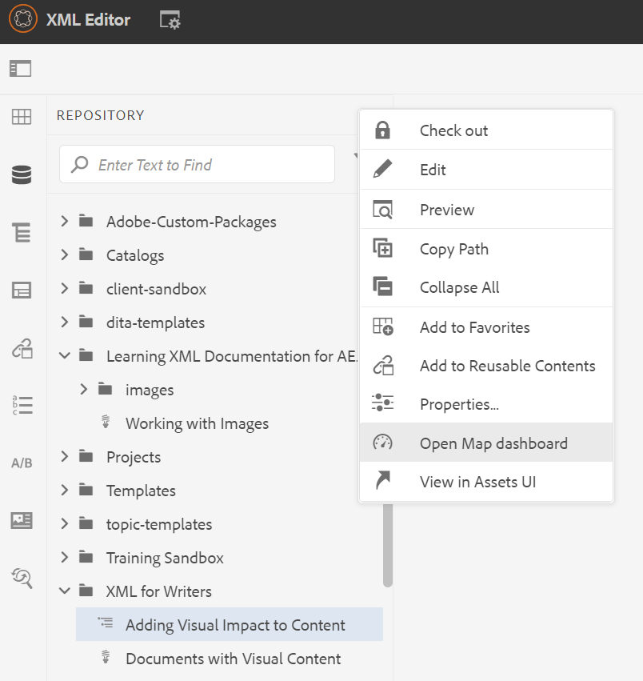
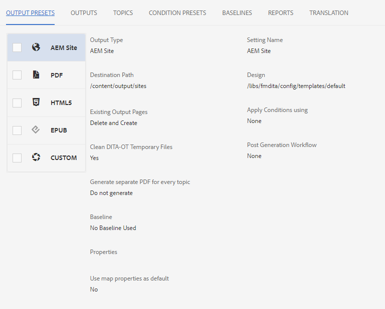
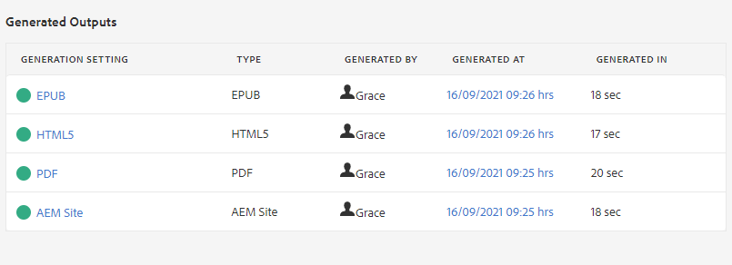
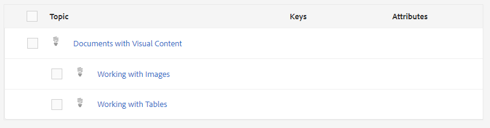
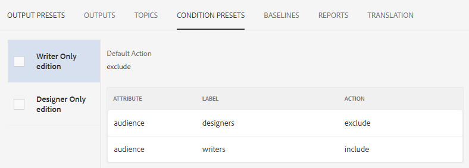
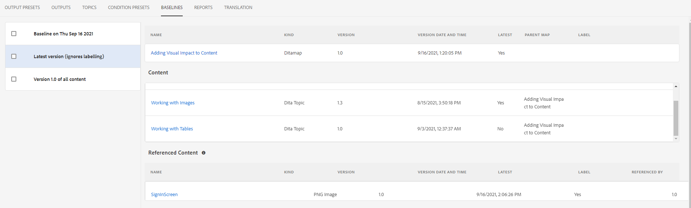
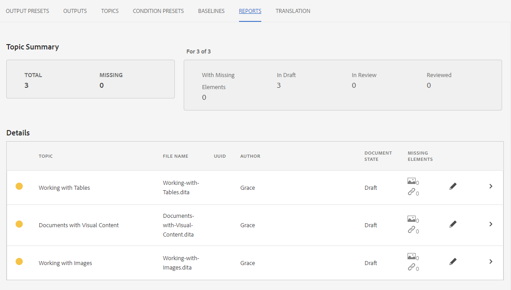

# Inleiding tot het kaartdashboard

Hieronder vindt u een overzicht van de belangrijkste functies van het kaartdashboard.

>[!VIDEO](https://video.tv.adobe.com/v/339040)

## Een kaart openen in het kaartdashboard

1. Selecteer in de Weergave Opslagplaats het pictogram Ovaal op de kaart om het menu Opties te openen en open vervolgens het dashboard Kaart.
   

   Het kaartdashboard wordt op een ander tabblad geopend.

## Componenten van het kaartdashboard

Het dashboard Kaart bevat een aantal tabbladen, waaronder voorinstellingen voor uitvoer, uitvoerresultaten, het gebruikte onderwerp, basislijnen en meer.

### Voorinstellingen uitvoer

Op het tabblad Uitvoervoorinstellingen worden de standaardvoorinstellingen voor de verschillende typen uitvoerbestanden weergegeven: AEM Site, PDF, HTML5, ePub en Aangepast.

U kunt een uitvoervoorinstelling selecteren om de details van de instellingen weer te geven, zoals de transformatienaam, het doelpad, de basislijnen en de toegepaste voorwaarden.

### Uitvoer

Op het tabblad Uitvoer worden alle eerder gegenereerde en momenteel gegenereerde uitvoerbestanden weergegeven.

Een groene cirkel onder de kolom Instellingen genereren geeft aan dat de uitvoer is gegenereerd. De tekst in deze kolom fungeert als een actieve hyperlink en u kunt deze selecteren om de gegenereerde uitvoer te openen. De items onder de kolom Type geven het uitvoertype aan.
Hier wordt ook andere informatie over de uitvoergeneratie weergegeven, zoals de naam van de gebruiker die de uitvoer heeft gegenereerd, de datum en tijd van de productie en de tijd die nodig was om de productie uit te voeren. Als er een fout tijdens generatie is, kunt u de datum en de tijd van generatie selecteren onder Gegenereerd bij kolom om het foutenlogboek te openen en te herzien.

### Onderwerpen

Het lusje van Onderwerpen toont een lijst van al uw onderwerpen binnen de kaart.

Door het selectievakje van een onderwerp te selecteren, kunt u extra handelingen uitvoeren. U kunt de tags bewerken, opnieuw genereren en weergeven, toepassen of verbergen.

### Voorinstellingen voorwaarde

Op het tabblad Voorinstellingen voor voorwaarden worden de instellingen weergegeven voor specifieke voorwaardelijke inhoud die moet worden opgenomen of uitgesloten.

Als u hier het selectievakje voor de editie Alleen schrijver inschakelt, wordt er een uitvoer gegenereerd die alle inhoud met het kenmerk &quot;publiek&quot; dat het label &quot;ontwerpers&quot; heeft, uitsluit en die alle inhoud met het label &quot;schrijvers&quot; bevat.

### Basislijnen

Op het tabblad Basislijnen kunt u uw basislijnen weergeven.

Basislijnen fungeren in de tijd als momentopnamen, zodat u een versie van uw onderwerpen en elementen kunt maken om te publiceren. Bijvoorbeeld, kan een basislijn die inhoud op een specifieke datum en een tijd vangt versie 1.3 van één onderwerp, en 1.0 van een ander onderwerp gebruiken, die op hun respectieve versies in die tijd wordt gebaseerd.
Als er geen basislijn is opgegeven, wordt de uitvoer gegenereerd met de meest recente versies van alle inhoud.

### Rapporten

Het lusje van Rapporten toont een samenvatting van onderwerpinformatie, met inbegrip van het aantal totale onderwerpen in gebruik, ontbrekende elementen binnen deze onderwerpen, en de documentstaat.

Als een onderwerp een element mist, kunt u de meest rechtse pijl in de rij selecteren om de ingang uit te breiden en details over de fout te bekijken.
