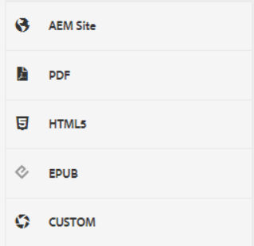
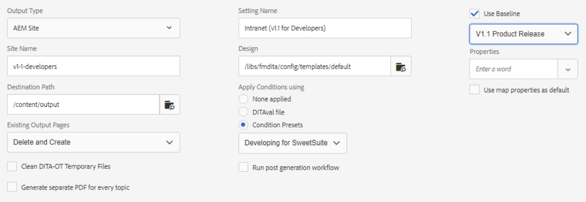

# Voorinstellingen uitvoer

Een uitvoervoorinstelling is een verzameling publicatieeigenschappen die aan een kaart zijn toegewezen. Deze kunnen indien nodig worden gemaakt of gewijzigd.

>[!VIDEO](https://video.tv.adobe.com/v/338989?quality=12&learn=on)

## Uitvoervoorinstellingen openen

Een uitvoervoorinstelling wordt weergegeven wanneer een kaart in de XML-editor wordt geopend in het Kaartdashboard. Voorinstellingen kunnen informatie bevatten over een specifiek uitvoertype, een doelpad, instructies voor het beheren van bestaande uitvoerpagina&#39;s en andere instellingen die op een kaart kunnen worden toegepast om uitvoer te genereren.

## Een uitvoervoorinstelling maken

>[!NOTE]
>
>OPMERKING: Sommige functies die worden gebruikt door een uitvoervoorinstelling, zijn mogelijk afhankelijk van de eerste ontwikkeling van een basislijn of een voorinstelling voor een voorwaarde. Als deze worden vereist moet u hen vormen gebruikend de aangewezen lusjes.

1. Selecteer een uitvoervoorinstelling voor de basislijn. U kunt bijvoorbeeld AEM of PDF selecteren als de nieuwe voorinstelling die u wilt maken, bestemd is voor een site of Adobe PDF-inhoud bevat.

2. Klikken **Maken**.

3. Selecteer indien nodig een uitvoertype.

4. Op basis van het uitvoertype configureert u de opties verder.

5. Klikken **Gereed**.

## Een uitvoervoorinstelling bewerken

Uitvoervoorinstellingen zijn vooraf gedefinieerd, maar kunnen zo nodig worden aangepast.

1. Open het kaartdashboard.

2. Selecteer **Voorinstellingen uitvoer** tab.

3. Selecteer een uitvoervoorinstelling.

4. Klikken **Bewerken**.

5. Wijzig desgewenst de instellingen.

   

6. Klikken **Gereed**.
