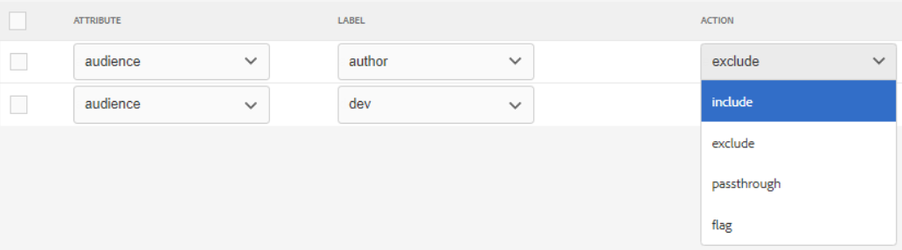

# Publiceren onder voorwaarden

Met voorwaardelijke publicatie kan één inhoudsbron worden geschreven voor een of meer doelgroepen, producten of platforms. Deze informatie kan dan dynamisch worden gepubliceerd en slechts specifiek vereiste inhoud inbegrepen in de output.

>[!VIDEO](https://video.tv.adobe.com/v/339041)

## Voorbereiden op de oefening

U kunt hier voorbeeldbestanden downloaden voor de oefening.

[Oefening-downloaden](assets/exercises/publishing-with-conditions.zip)

## Inhoud markeren met voorwaardelijke kenmerken

1. Open het onderwerp dat u wilt wijzigen.

2. Voer de tekst in die voorwaardelijk moet worden. Bijvoorbeeld een of meer alinea&#39;s, een hele tabel, een figuur of andere inhoud.

   

3. Selecteer de specifieke inhoud waaraan u een voorwaardelijk kenmerk wilt toewijzen. Bijvoorbeeld één alinea in de bron.

   

4. Controleer in de rechterspoorlijn de weergave Eigenschappen.

5. Voeg een attribuut voor publiek, product, of platform toe.

6. Wijs een waarde toe aan het kenmerk. De weergave van de inhoud wordt bijgewerkt om voorwaardelijke opmaak weer te geven.

   

## Voorvertoning van voorwaardelijke inhoud weergeven

1. Klikken **Voorvertoning**.

2. Onder **Filters** selecteert of deselecteert u de voorwaarden die u wilt weergeven of verbergen.

3. Selecteren of deselecteren **Tekst markeervoorwaarden**.

   

## Een voorinstelling voor een voorwaarde maken

Een voorinstelling voor een voorwaarde is een verzameling eigenschappen die definiëren wat tijdens het genereren van de uitvoer moet worden opgenomen of uitgesloten of anderszins gemarkeerd.

1. Selecteer in het dashboard Kaart de optie **Voorinstellingen voorwaarde** tab.

2. Klikken **Maken**.

3. Selecteren **Toevoegen** (of **Alles toevoegen**).

4. Geef de voorwaarde een naam.

5. Selecteer een kenmerk-, label- en actiecombinatie.

   

6. Herhaal deze bewerking zo nodig.

7. Klikken **Opslaan**.

## Voorwaardelijke uitvoer genereren

Als de voorwaarden eenmaal zijn toegepast op de inhoud, kan deze worden gegenereerd als uitvoer. Dit kan een Voorinstelling Voorwaarde of een DITAval-bestand gebruiken.

## Voorwaardelijke uitvoer genereren met behulp van een voorinstelling voor voorwaarde

1. Selecteer **Voorinstellingen uitvoer** tab.

2. Selecteer een uitvoervoorinstelling.

3. Klikken **Bewerken**.

4. Onder **Voorwaarde toepassen met** Selecteer een voorinstelling voor Voorwaarde.

   

5. Klikken **Gereed**.

6. Genereer de uitvoervoorinstelling en bekijk de inhoud.

## Voorwaardelijke uitvoer genereren met een DITAval-bestand

Het DITAval-bestand kan worden gebruikt om voorwaardelijke inhoud te publiceren. Hiervoor moet een bestand worden gemaakt of geüpload en er moet bij publicatie naar worden verwezen.

1. Selecteer **Voorinstellingen uitvoer** tab.

2. Selecteer een uitvoervoorinstelling.

3. Klikken **Bewerken**.

4. Selecteer onder Voorwaarde toepassen met een DITAval-bestand.

   

5. Klikken **Gereed**.

6. Genereer de uitvoervoorinstelling en bekijk de inhoud.
