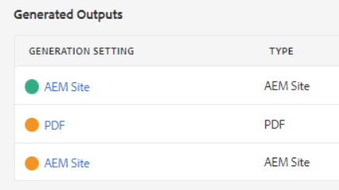
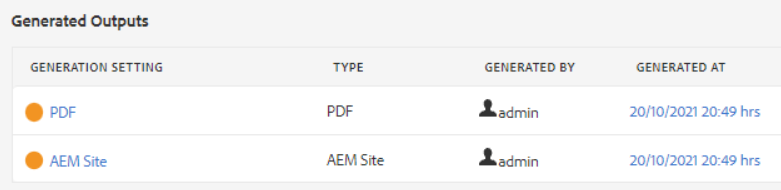
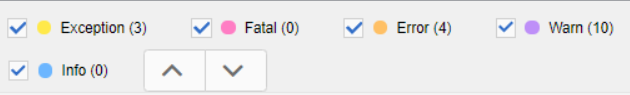

# Problemen met publicatiefouten oplossen

Het publiceren van een kaart is doorgaans eenvoudig. Open de kaart, selecteer een Vooraf ingestelde Output, en produceer output! Nochtans, als een kaart, of zijn onderwerpen fouten in hen hebben kan de outputgeneratie ontbreken. Wanneer dit gebeurt, is het belangrijk om te weten hoe te problemen op te lossen.

>[!VIDEO](https://video.tv.adobe.com/v/338990?quality=12&learn=on)

## Voorbereiden op de oefening

U kunt hier voorbeeldbestanden downloaden voor de oefening.

[Oefening-downloaden](assets/exercises/publishing-basic-to-advanced.zip)

## Algemene oorzaken van publicatiefouten

Er kunnen fouten in de broninhoud worden ingevoegd. Bijvoorbeeld:

* Verwijzing naar onjuist benoemd bestandspad

* Onjuiste benoemde map

* Afbeelding of bestand ontbreekt

* Onjuist geconfigureerde inhoudsverwijzing

* Verbroken kruisverwijzing

* Fouten in de waarden van een kenmerk (bijvoorbeeld een tekenreeks in plaats van een getal)

* Onjuiste installatie van componenten die worden gebruikt door [!DNL AEM Guides]

## Gevolgen van fouten

Een fout kan klein zijn en in een eenvoudige nota resulteren om u te laten weten dat een dossier niet met succes werd verpakt, of ernstig genoeg dat het tot een volledig mislukken leidt om output te produceren. Op het tabblad Uitvoer worden pictogrammen met kleurcodering weergegeven om aan te tonen dat de uitvoer is gelukt, dat er fouten zijn opgetreden of dat de uitvoer is gegenereerd.

## Logbestanden van fouten openen en bekijken

Het logbestand dat wordt gegenereerd, kan worden geopend voor revisie.

1. In de **Uitvoer** klikt u op de knop **datum/tijd onder Gegenereerd op.**

   

2. Blader door het foutenlogboek.

## Fouttypen weergeven en verbergen

In het foutenlogboek wordt elk fouttype in een unieke kleur weergegeven.

1. **Selecteren** of **deselecteren** een fouttype om markering weer te geven of te verbergen.

2. Navigeren door fouten met de **next** of **vorige** knoppen (pijlen).

## Fouten oplossen

Afhankelijk van het type fout kan de resolutie eenvoudig of complex zijn. Het kan door een auteur in de Redacteur van XML worden voltooid, of kan een beheerder vereisen om met te werken [!DNL AEM Guides]. Specifieke correcties zijn afhankelijk van de fout, het effect en uw organisatorische workflows.

* Verwijzing naar onjuist benoemd bestandspad

       Auteurs kunnen de padverwijzing in het brondocument bijwerken.
       
   
* Onjuiste benoemde map

       Auteurs kunnen de mapnaam bijwerken of bestanden naar wens verplaatsen.
       
   
* Afbeelding of bestand ontbreekt

       Auteurs kunnen een ontbrekende afbeelding/bestand uploaden, de naam van een afbeelding/bestand wijzigen of een afbeelding/bestand verplaatsen
       
   
* Onjuist geconfigureerde inhoudsverwijzing

       Auteurs kunnen de locatie van de inhoud waarnaar wordt verwezen, corrigeren of het pad naar de inhoudsverwijzing wijzigen.
       
   
* Verbroken kruisverwijzing

       Auteurs kunnen de locatie waarnaar de kruisverwijzing verwijst, corrigeren of de naam of eigenschappen van het doelbestand wijzigen
       
   
* Fouten in de waarden van een kenmerk (bijvoorbeeld een tekenreeks in plaats van een getal)

       Auteurs kunnen het kenmerk bijwerken naar een correcte waarde of beheerders kunnen het systeem bijwerken ter ondersteuning van nieuwe waarden.
       
   
* Onjuiste installatie van componenten die worden gebruikt door [!DNL AEM Guides]

       Beheerders kunnen de installatie van het systeem, de onderdelen ervan of machtigingen bijwerken.
       
   