# Werken met rapporten

Op het tabblad Rapporten in het dashboard Kaart kunt u verbroken koppelingen, inhoud waarnaar wordt verwezen en die opnieuw wordt gebruikt (conrefs), kruisverwijzingen of andere ontbrekende informatie identificeren en oplossen.

>[!VIDEO](https://video.tv.adobe.com/v/339039?quality=12&learn=on)

## Voorbereiden op de oefening

U kunt hier voorbeeldbestanden downloaden voor de oefening.

[Oefening-downloaden](assets/exercises/working-with-reports.zip)

## Elementen uploaden

1. Selecteer in de weergave Opslagplaats het pictogram Ovaal in de hoofdmap om het menu Opties te openen.

   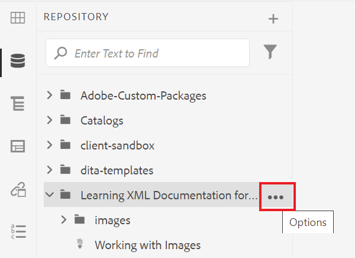

2. Selecteer **[!UICONTROL Upload Assets]**.

   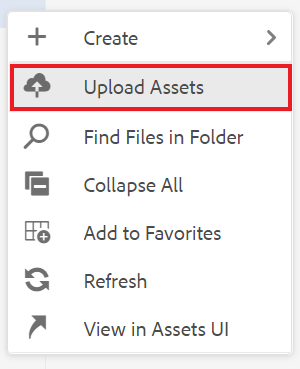

3. Selecteer de bestanden die u naar de map wilt uploaden en selecteer **Uploaden**.

De DITA-bestanden worden geopend en u moet ze controleren op problemen met ontbrekende inhoud, conrefs of kruisverwijzingen.

## Een kaart maken

1. Selecteer het pictogram Ovaal in de hoofdmap om het menu Opties te openen.

   

2. Selecteren **Maken > Kaart**.

   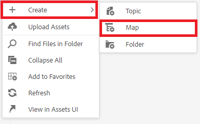

   Het dialoogvenster Nieuwe kaart maken wordt weergegeven.

3. Selecteer in het veld Sjabloon de optie **Bladwijzer** (of **Kaart** op basis van het inhoudstype dat u maakt) in het keuzemenu en geef uw kaart een titel.

4. Selecteer **Maken**.

Uw kaart wordt gemaakt en de linkerrails veranderen automatisch van de weergave Opslagplaats naar de weergave Kaart.

## Toevoegen van kaartcomponenten

1. Selecteer het potloodpictogram in de linkerspoorstaaf.
Dit is het bewerkingspictogram, waarmee u de kaart in de editor kunt openen.

   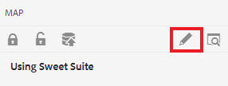

2. Schakel terug naar de weergave Opslagplaats door het pictogram Opslagplaats te selecteren.

   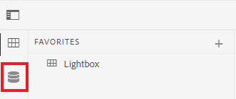

3. Voeg een onderwerp aan de kaart toe door het van Repository in de kaart in de redacteur te slepen en te laten vallen.
De lijnindicator zal u tonen waar uw onderwerp zal worden geplaatst.

4. Voeg desgewenst onderwerpen toe.

5. Als u klaar bent, selecteert u **Opslaan als nieuwe versie.**

   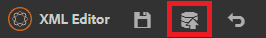

6. In de *Opmerkingen voor nieuwe versie* voert u een beschrijvende opmerking in.

7. Selecteren **Opslaan**.

## Een AEM Site-uitvoer genereren

1. Selecteer in de Repository het Ellipsis-pictogram op de kaart om het menu Opties te openen en klik vervolgens op **Open Kaartdashboard.**

   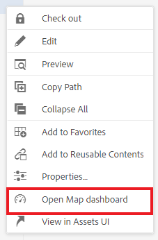

   Het kaartdashboard wordt op een ander tabblad geopend.
2. Selecteer op het tabblad Uitvoervoorinstellingen de optie **Site AEM**.

   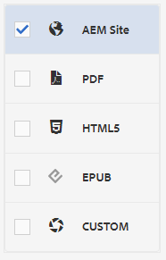

3. Selecteren **Genereren**.

4. Navigeer naar de pagina Uitvoer om de status van de gegenereerde uitvoer weer te geven.
Als er fouten zijn, kan op het tabblad Uitvoer een oranje cirkel worden weergegeven onder de kolom Generatie-instelling in plaats van groen om aan te geven dat het genereren is voltooid.

5. Selecteer de koppeling onder de kolom Generatie-instelling om de gegenereerde uitvoer te openen.
Controleer de uitvoer op ontbrekende inhoud.

## Het tabblad Rapporten

Het lusje van Rapporten toont een onderwerpsamenvatting, en een lijst die onderwerpinformatie en de kwesties binnen uw kaart bevatten.

In het ideale geval controleert u altijd de Rapporten op een kaart nadat u inhoud hebt geïmporteerd.

De kolom Ontbrekende elementen geeft het aantal ontbrekende afbeeldingen en verbroken conrefs aan. U kunt de **Potlood** pictogram om het onderwerp in de redacteur te openen.

## Ontbrekende afbeeldingen oplossen

Als er afbeeldingen ontbreken in uw bestanden, kan de algemene reden hiervoor zijn dat de inhoud wel is geüpload, maar dat dit niet het geval is bij afbeeldingen. Als dat het geval is, lost u de problemen met ontbrekende afbeeldingen op door afbeeldingen te uploaden naar een specifieke map die overeenkomt met het pad en de bestandsnamen die door bestanden worden verwacht.

1. In *Weergave opslagplaats* selecteert u het pictogram Ovaal in de map met afbeeldingen om het menu Opties te openen.

   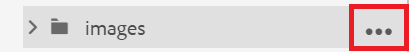

2. Selecteren **[!UICONTROL Upload Assets]** en selecteer de ontbrekende afbeeldingen.

3. Selecteren **Uploaden**.

De ontbrekende afbeeldingen zijn geüpload. Deze afbeeldingen worden nu weergegeven in een nieuw gegenereerde AEM Site-uitvoer en op het tabblad Rapporten worden geen ontbrekende afbeeldingsfouten meer weergegeven.

## Gebroken conrefs oplossen

Als inhoud waarnaar elders wordt verwezen (een conref), verwijst naar een bestand in een andere map (bijvoorbeeld een map met de naam &quot;reuse&quot;). en de inhoud niet is geüpload, moet een fout worden opgelost. U moet bijvoorbeeld een submap maken met de naam &quot;hergebruik&quot; en het ontbrekende bestand uploaden naar &quot;hergebruik&quot;.

### Middelen uploaden met de [!UICONTROL Assets] UI

Naast de [!UICONTROL Upload Assets] kunt u elementen uploaden door deze naar de interface Elementen te slepen.

1. Selecteer in de weergave Opslagplaats het Ellipsis-pictogram in de map voor hergebruik om het menu Opties te openen.

   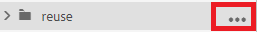

2. Selecteren **Weergeven in interface Elementen**.

   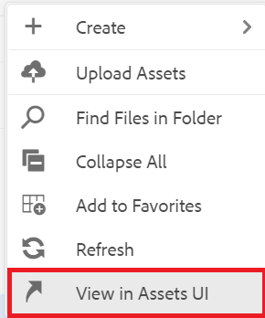

3. Sleep het bestand naar de map.
Het bestand wordt geüpload en de fout conref is opgelost.

Alle fouten zijn nu opgelost. De pagina Rapporten geeft aan dat er geen fouten meer zijn en het genereren van een AEM Site resulteert in een volledige uitvoer zonder ontbrekende componenten.
