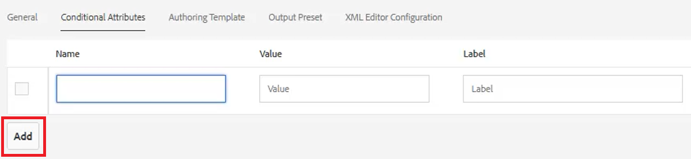
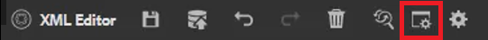
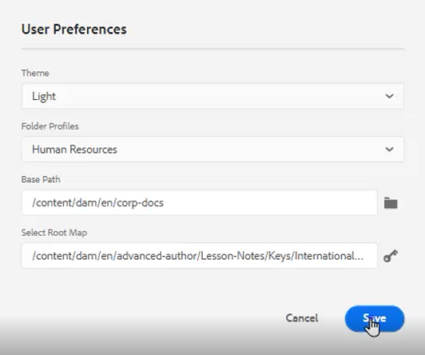
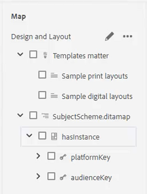
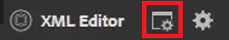
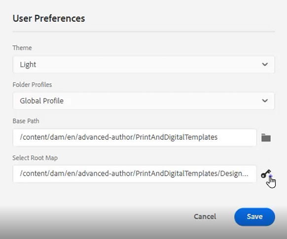

# Voorwaarden

In DITA, worden de voorwaarden vaak gedreven door attributen zoals Product, Platform, en Publiek. Deze kunnen ook specifieke waarden hebben die aan hen worden toegewezen. Gebruikers kunnen dit alles beheren via Mapprofielen.

Voorbeeldbestanden die u voor deze les wilt gebruiken, staan in het bestand [condities.zip](assets/conditions.zip).

>[!VIDEO](https://video.tv.adobe.com/v/342755)

## Voorwaarden toewijzen aan een mapprofiel

1. Selecteer **Mapprofielen** tegel.

2. Klikken [!UICONTROL **Voorwaardelijke kenmerken**].

3. Klikken [!UICONTROL **Bewerken**] in de linkerbovenhoek van het profiel.

4. Klikken [!UICONTROL **Toevoegen**].

   

5. Vul de vereiste velden in.

   ・ De naam moet overeenkomen met een kenmerk dat wordt gebruikt voor het maken van profielen.

   ・ De waarde is de nauwkeurige ingang die in de DITA codebron zal worden gebruikt.

   ・ Het label is het woord dat wordt weergegeven door de gebruiker die kenmerken invoert.

6. Klikken [!UICONTROL **Opslaan**].

>[!NOTE]
>
>OPMERKING: het configureren van een globaal profiel kan een vroege en efficiënte manier zijn om het gebruik van kenmerken en waarden te beheren volgens een consistente stijlhulplijn.

## Kenmerken toewijzen aan elementen

Als er geen aangepast mapprofiel aan een concept is toegewezen, kunt u desgewenst kenmerken aan specifieke elementen, zoals alinea&#39;s, toewijzen.

1. Van de **Weergave opslagplaats**, klikt u op het element waarmee u wilt werken om het te selecteren.

2. In de **Eigenschappen van inhoud** klikt u op het deelvenster [!UICONTROL **Kenmerk**] vervolgkeuzelijst.

3. Kies het kenmerk dat u wilt toewijzen.

4. Voeg een **Waarde**.

Het kenmerk en de waardepapier worden nu toegewezen aan het geselecteerde element.

## Kenmerk- en waardeparen toewijzen met voorwaarden

In het deelvenster Voorwaarden kunt u kenmerken en waarden op een gecontroleerde manier toewijzen.

1. De **Gebruikersvoorkeuren**.

   a. Klik op het pictogram Gebruikersvoorkeuren.

   

   b. Vul de vereiste velden in het dialoogvenster **Gebruikersvoorkeuren** . Bijvoorbeeld:

   

   c. Klikken [!UICONTROL **Opslaan**].

2. Vouw in het deelvenster Voorwaarden de vervolgkeuzelijsten voor Publiek en Platform uit. De beschikbare voorwaarden zijn specifiek voor het mapprofiel.

3. Sleep een voorwaarde naar het gewenste element om deze toe te wijzen.

## Een onderwerpregeling toewijzen

De kaarten van het onderwerpRegeling zijn een gespecialiseerde vorm van ditamap en door een kaart van verwijzingen voorzien. Onderwerpregelingen worden gebruikt om taxonomieën te definiëren. Ze bieden controle over de beschikbare waarden.

1. Ga naar de **Weergave opslagplaats**.

2. Selecteer een kaart die verwijst naar het onderwerpschema ditamap. In dit voorbeeld wordt de kaart met de naam _Ontwerp en lay-out_.

   

3. Gebruikersvoorkeuren configureren.

   a. Klik op de knop [!UICONTROL **Gebruikersvoorkeuren**] pictogram.

   

   b. Vul de velden in het dialoogvenster **Gebruikersvoorkeuren** .

   c. Klik op het mapsymbool naast het veld Basispad om het pad naar het gewenste bestand te kiezen.

   d. Klikken [!UICONTROL **Selecteren**].

   e. Klik op het hoofdsymbool naast de knop **Hoofdmap** veld om een pad in te voeren.

   >[!IMPORTANT]
   >
   >Belangrijk: de geselecteerde kaart van de Wortel moet de kaart zijn die het OnderwerpRegeling bevat.

   

   f. Beperk de weergegeven elementen door de map(pen) te selecteren die u wilt gebruiken.

   g. Klikken [!UICONTROL **Selecteren**].

   h. Klikken [!UICONTROL **Opslaan**].

Het onderwerpprogramma is nu toegewezen.

## Het onderwerpschema weergeven vanuit het deelvenster Voorwaarden

1. Navigeren naar **Editor-instellingen**.

2. Selecteer **Voorwaarden** tab.

3. Het selectievakje inschakelen **Het onderwerpschema tonen in het deelvenster Voorwaarden**
