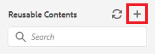

# Inhoud opnieuw gebruiken

Een van de belangrijkste functies van DITA is de mogelijkheid om inhoud opnieuw te gebruiken. Het staat hergebruik van inhoud van kleine uitdrukkingen tot volledige onderwerpen of kaarten toe.  Om inhoud echter doeltreffend te kunnen hergebruiken, moet deze goed worden beheerd. Zorg ervoor dat u een effectieve inhoudsstrategie hebt wanneer u werkt met herbruikbare informatie.

>[!VIDEO](https://video.tv.adobe.com/v/342757?quality=12&learn=on)

## Een herbruikbaar onderwerp maken

Wanneer een verandering in een herbruikbaar brononderwerp wordt aangebracht, zal de informatie overal bijwerken de inhoud wordt gebruikt.

1. Ga naar de **Bewaarplaats**.

2. Klik op de knop **contextueel menu** naast de map voor hergebruik.

3. Kies **Maken > Dita Topic**.

4. Vul de velden in het dialoogvenster Nieuw onderwerp maken. Bijvoorbeeld:

   

5. Klikken [!UICONTROL **Maken**].

6. Voeg desgewenst inhoud toe aan het onderwerp.

## Voeg een nieuw herbruikbaar element aan een onderwerp toe

Er zijn verschillende methoden om herbruikbare elementen toe te voegen. Hier is de eerste workflow het beste wanneer u slechts één component toevoegt. De tweede workflow is beter voor het toevoegen van meerdere herbruikbare componenten.

### Workflow 1

1. Klik in het onderwerp bij een geldige plaats.

2. Selecteer **Herbruikbare inhoud invoegen** op de bovenste werkbalk.

   

3. Klik in het dialoogvenster Inhoud opnieuw gebruiken op de knop [!UICONTROL **Map**] pictogram.

4. Navigeer naar de gewenste map.

5. Kies een onderwerp met herbruikbare componenten.
Bijvoorbeeld:

   

6. Klikken [!UICONTROL **Selecteren**].

7. Kies een specifieke component die u opnieuw wilt gebruiken.

8. Klikken [!UICONTROL **Selecteren**].

Het herbruikbare element is nu opgenomen in het onderwerp.

### Workflow 2

1. Navigeren naar **Herbruikbare inhoud** in het linkerdeelvenster.

2. Klik op de knop [!UICONTROL **Toevoegen**] in het deelvenster Opnieuw te gebruiken inhoud.

   

3. Navigeer naar een map.

4. Selecteer een specifiek onderwerp of specifieke onderwerpen.

5. Klikken [!UICONTROL **Toevoegen**].

6. Vouw vanuit het deelvenster Opnieuw bruikbare inhoud uit **Overzicht van element**.

7. Sleep een element naar het onderwerp op een geldige locatie.

Het herbruikbare element is nu opgenomen in het onderwerp.

## Een id en waarde toewijzen aan een element

De dlentry die u zojuist hebt gemaakt, is een herbruikbaar element. Daarom is een id en een waarde vereist.

1. Klik in de vervolgkeuzelijst.

2. Klik in het deelvenster Eigenschappen van inhoud op het vervolgkeuzemenu onder Kenmerk.

3. Selecteren **ID**.

4. Typ een logische naam voor de waarde.

5. Sla het onderwerp op of verander het zodat de wijziging doorgaat in de opslagplaats.

De id en de waarde zijn toegewezen aan het element.
