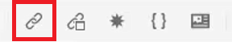
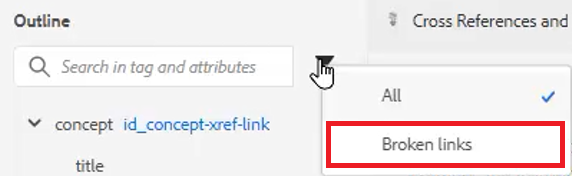

# Kruisverwijzingen en koppelingen

De Redacteur van XML en DITA verstrekken een krachtige manier om tussen onderwerpen te verbinden. Het is belangrijk dat u de verwijzingen naar inhoud op effectieve wijze beheert. U moet daarbij ook werken met unieke id-waarden.

Voorbeeldbestanden die u voor deze les wilt gebruiken, staan in het bestand
[crossreferencesandlinks.zip](assets/crossreferencesandlinks.zip)

>[!VIDEO](https://video.tv.adobe.com/v/342764?quality=12&learn=on)

## Een kruisverwijzing naar een extern onderwerp maken

Het is mogelijk om een externe kruisverwijzing te maken door een onderwerp vanuit de opslagplaats naar een geopend bestand te slepen. Als u echter verbroken kruisverwijzingen wilt voorkomen, moet een id eerst worden gedefinieerd voor een waarde die gerelateerd is aan het bovenliggende element. Dit is een eenvoudige manier om een kruisverwijzing te maken en er tegelijkertijd voor te zorgen dat id&#39;s correct worden toegewezen.

1. Open een bestand waarin u een externe kruisverwijzing wilt invoegen.

1. Wijs een id toe aan het element waarnaar moet worden verwezen.

   a. Klik in het element.

   b. Kies in het deelvenster Eigenschappen van inhoud de optie **ID** in het vervolgkeuzemenu Kenmerk.

   c. Typ een logische naam in het veld Waarde.

   d. Het element en de bijbehorende waarde weergeven in **Omtrekweergave** indien gewenst.

1. **Opslaan** het onderwerp om Repository te verzekeren heeft bijgewerkte identiteitskaart

1. Klik op de knop [!UICONTROL **Referentie**] op de bovenste werkbalk.

   

1. Van de **Content Reference** selecteert u de id en de elementkoppeling die u als kruisverwijzing wilt invoegen.

1. Klikken [!UICONTROL **Selecteren**].

De kruisverwijzing is toegevoegd aan het onderwerp.

## Koppelen naar een website

U kunt een koppeling invoegen naar een website in een willekeurig onderwerp. Raadpleeg de video AEM Hulplijnen, cursus 1 over Koppelen naar websites voor meer informatie.

## verbroken koppelingen weergeven

Sommige wijzigingen kunnen leiden tot verbroken kruisverwijzingen. Deze omvatten het schrappen van een onderwerp, het reorganiseren van een sectie die een verwijzing bevat, of het veranderen van identiteitskaart nadat de verwijzing is opgenomen. Merk op dat een steekproefonderwerp _crossreferencesandlinks.zip_ wordt voorzien van deze les die verscheidene van bulleted verwijzingen naar interne inhoud zal veroorzaken om te breken.

1. Ga naar de **Omtrekweergave** in het linkerdeelvenster.

1. Klik op de knop [!UICONTROL **Filter**] pictogram.

1. Selecteren **Verbroken koppelingen**.

   

Verbroken koppelingen worden weergegeven als klikbare objecten. U kunt ze in rode tekst in het onderwerp identificeren.
