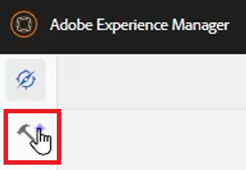

# XML Editor-configuratie

Als u in een restrictieve omgeving werkt, kunt u kiezen welke eigenschappen uw auteurs kunnen zien door de Configuratie van de Redacteur binnen een specifiek Profiel van de Omslag aan te passen. Door dit mapprofiel toe te passen, kunt u de vormgeving van de Editor zelf, de CSS-sjablonen, de beschikbare fragmenten en de labels voor inhoudsversies wijzigen.

Voorbeeldbestanden die u voor deze les wilt gebruiken, staan in het bestand [xmleditorconfiguration.zip](assets/xmleditorconfiguration.zip).

>[!VIDEO](https://video.tv.adobe.com/v/342762?quality=12&learn=on)

## De standaardconfiguratie van de Editor UI aanpassen

U kunt de standaardconfiguratie UI altijd downloaden naar uw lokale systeem, veranderingen in het aanbrengen in de tekstredacteur van uw keus, en het opnieuw uploaden.

1. Klik in het navigatiescherm op de knop [!UICONTROL **Gereedschappen**] pictogram.

   

2. Selecteren **Hulplijnen** in het linkerdeelvenster.

3. Klik op de knop [!UICONTROL **Mapprofielen**] tegel.

   

4. Selecteer een mapprofiel.

5. Klik op de knop [!UICONTROL **XML Editor-configuratie**] tab.

6. Klikken [!UICONTROL **Downloaden**] Standaard.

   

U kunt de inhoud nu openen en wijzigen in een teksteditor. De _Installatie en configuratie van hulplijnen AEM_ De gids bevat steekproeven van hoe te om, functies te verwijderen aan te passen of toe te voegen aan de configuratie UI.

## De aangepaste UI-configuratie van de XML-editor uploaden

Nadat u de UI-configuratie hebt aangepast, kunt u deze uploaden. Let op: een voorbeeldconfiguratiebestand _ui-config-restricted-editor.json_ wordt voorzien van de reeks ondersteunende onderwerpen voor deze les.

1. Klik in het mapprofiel op de knop [!UICONTROL **XML Editor-configuratie**] tab.

2. Klik onder UI-configuratie van XML Editor op [!UICONTROL **Uploaden**].

   

3. Dubbelklik op het bestand voor de gewijzigde UI-configuratie of, zoals u hier ziet, op het beschikbare voorbeeldbestand.

   

4. Klikken [!UICONTROL **Opslaan**] in de linkerbovenhoek van het scherm.

U hebt met succes de gewijzigde configuratie UI geupload.

## De CSS-sjabloonlay-out aanpassen

Net als bij de UI-configuratie kunt u de CSS-sjabloonlay-out downloaden. U kunt het in een tekstredacteur openen en wijzigingen aanbrengen om de blik en het gevoel van uw onderwerp aan te passen alvorens te uploaden.

1. Klik in het navigatiescherm op de knop [!UICONTROL **Gereedschappen**] pictogram.

   

2. Selecteren **Hulplijnen** in het linkerdeelvenster.

3. Klik op de knop [!UICONTROL **Mapprofielen**] tegel.

   

4. Selecteer een mapprofiel.

5. Klik op de knop [!UICONTROL **XML Editor-configuratie**] tab.

6. Klik onder CSS-sjabloonlay-out op [!UICONTROL **Downloaden**].

   

U kunt de CSS-inhoud nu wijzigen en opslaan in een teksteditor.

## De gewijzigde CSS-sjabloonlay-out uploaden

Nadat u de CSS-sjabloonlay-out hebt aangepast, kunt u deze uploaden. Een voorbeeldbestand _css-layout-ONLY-draft-comment-change.css_ wordt voorzien van de reeks ondersteunende onderwerpen voor deze les. Dit bestand bevat alleen de conceptwijziging van opmerkingen, terwijl _css-layout-draft-comment-change.css_ is het volledige bestand, dat u alleen kunt testen of controleren.

1. Klik in het mapprofiel op de knop [!UICONTROL **XML Editor-configuratie**] tab.

2. Klik onder CSS-sjabloonlay-out op [!UICONTROL **Uploaden**].

   

3. Dubbelklik op het bestand voor uw eigen aangepaste CSS-indeling of het voorbeeldbestand dat u hier ziet.

   

4. Klikken [!UICONTROL **Opslaan**] in de linkerbovenhoek van het scherm.
De aangepaste CSS-sjabloonindeling is geüpload.

## XML Editor-fragmenten bewerken

Fragmenten zijn herbruikbare stukken inhoud die specifiek kunnen zijn voor een product of groep. Let erop dat voorbeeldfragmenten de ondersteuningsbestanden voor deze les krijgen.

1. Klik in het navigatiescherm op de knop [!UICONTROL **Gereedschappen**] pictogram.

   

2. Selecteren **Hulplijnen** in het linkerdeelvenster.

3. Klik op de knop [!UICONTROL **Mapprofielen**] tegel.

   

4. Selecteer een mapprofiel.

5. Klik op de knop [!UICONTROL **XML Editor-configuratie**] tab.

6. Klik onder Fragmenten van de XML-editor op **Uploaden**.

   

7. Kies uw eigen fragmenten of gebruik de meegeleverde voorbeelden.

   

8. Klikken [!UICONTROL **Opslaan**] in de linkerbovenhoek van het scherm.

U hebt nieuwe fragmenten toegevoegd aan de Editor.

## Versielabels voor XML-inhoud aanpassen

Auteurs kunnen standaard zelf labels maken en deze koppelen aan onderwerpbestanden. Dit kan tot verschillende variaties op hetzelfde etiket leiden. U voorkomt inconsistente labeling door uit lijsten met vooraf gedefinieerde labels te kiezen.

1. Klik in het navigatiescherm op de knop [!UICONTROL **Gereedschappen**] pictogram.

   

2. Selecteren **Hulplijnen** in het linkerdeelvenster.

3. Klik op de knop [!UICONTROL **Mapprofielen**] tegel.

   

4. Selecteer een mapprofiel.

5. Klik op de knop [!UICONTROL **XML Editor-configuratie**] tab.

6. Klik onder Versielabels voor XML-inhoud op [!UICONTROL **Downloaden**].

   

U kunt de labels nu naar wens aanpassen.

## Versielabels voor XML-inhoud uploaden

Nadat u de labels hebt gedownload en gewijzigd, kunt u het onderwerp Versielabel voor XML-inhoud uploaden. U kunt ervoor kiezen het voorbeeldbestand te gebruiken _labels.json_, met de reeks ondersteunende onderwerpen voor deze les.

1. Klik in het mapprofiel op de knop [!UICONTROL **XML Editor-configuratie**] tab.

2. Klik onder Versielabels voor XML-inhoud op [!UICONTROL **Uploaden**].

   

3. Dubbelklik op het bestand voor uw eigen aangepaste labels of het voorbeeldbestand dat u hier ziet.

   

4. Klikken [!UICONTROL **Opslaan**] in de linkerbovenhoek van het scherm.

U hebt aangepaste labels voor XML-inhoudsversies geüpload.
