# Mapprofielen

AEM biedt snelle toegang tot configuratiehulpmiddelen. Door de Profielen van de Omslag aan te passen, kunnen de verschillende afdelingen of de producten unieke malplaatjes, auteursmilieu&#39;s, voorwaardelijke attributenprofielen, Fragmenten, of zelfs de configuraties van de Redacteur van het Web hebben.

Voorbeeldbestanden die u voor deze les wilt gebruiken, staan in het bestand [mapprofielen.zip](assets/folderprofiles.zip).

>[!VIDEO](https://video.tv.adobe.com/v/342758?quality=12&learn=on)

## Mapprofielen openen

Configuraties worden beheerd via het pictogram Mapprofielen.

1. Klik in het navigatiescherm op de knop [!UICONTROL **Gereedschappen**] pictogram.

   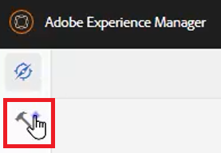

1. Selecteren **Hulplijnen** in het linkerdeelvenster.

1. Klik op de knop [!UICONTROL **Mapprofielen**] tegel.

   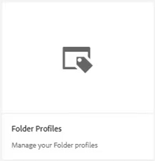

1. Selecteer het gewenste profiel. Kies bijvoorbeeld **Globaal profiel**, het standaardprofiel.

   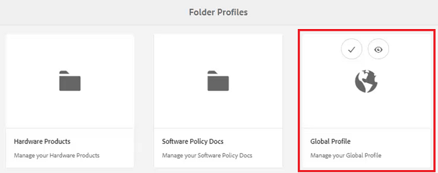

## Voorwaardelijke kenmerken bewerken in het algemene profiel

Zodra u het Globale Profiel hebt betreden kunt u zijn configuratie uitgeven. De instellingen voor het algemene profiel worden toegepast op alle gebruikers, tenzij anders aangegeven.

1. Selecteer in het algemene profiel de optie **Voorwaardelijke kenmerken** tab.

1. Klikken [!UICONTROL **Bewerken**] in de linkerbovenhoek van het scherm.

   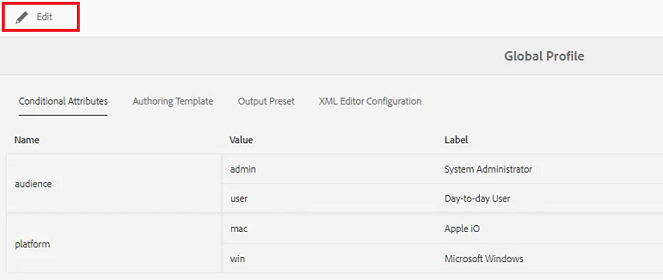

1. Klikken [!UICONTROL **Toevoegen**].

1. Vul de **Naam**, **Waarde**, en **Label** velden voor de nieuwe voorwaarde.

   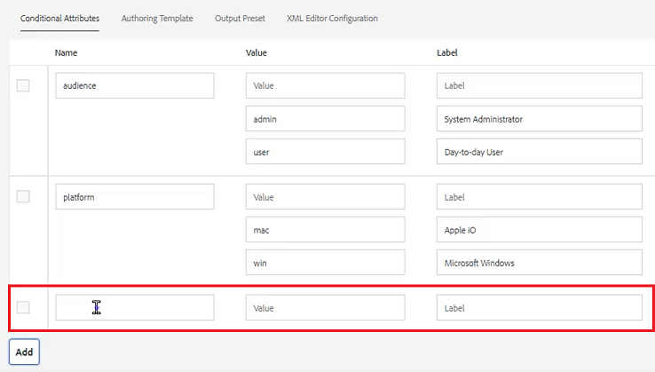

1. Klikken [!UICONTROL **Opslaan**] in de linkerbovenhoek van het scherm.
De nieuwe voorwaarde is nu beschikbaar voor alle gebruikers. U kunt het selecteren in het deelvenster Eigenschappen van inhoud en het toepassen op de gewenste inhoud.

## Een nieuw mapprofiel maken

Naast het standaard algemene profiel kunt u ook uw eigen aangepaste profielen maken.

1. Klik in het navigatiescherm op de knop [!UICONTROL **Gereedschappen**] pictogram.

   

1. Selecteren **Hulplijnen** in het linkerdeelvenster.

1. Klik op de knop [!UICONTROL **Mapprofielen**] tegel.

   

1. Klikken [!UICONTROL **Maken**].

1. In het dialoogvenster Mapprofiel maken.

   a. Geef het profiel een naam.

   b. Geef een pad op.

   c. Klikken [!UICONTROL **Maken**].

   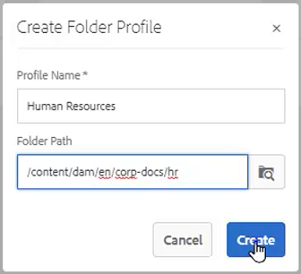

Er wordt een tegel met de nieuwe profielnaam weergegeven op de pagina Mapprofielen.

## Beheerders toevoegen via het tabblad Algemeen

Administratieve gebruikers hebben rechten om de Voorwaardelijke Attributen, het Authoring Malplaatje, en de Voorinstellingen van de Output voor het Profiel van de Omslag bij te werken.

1. Klik op de tegel om het gewenste mapprofiel te openen.

   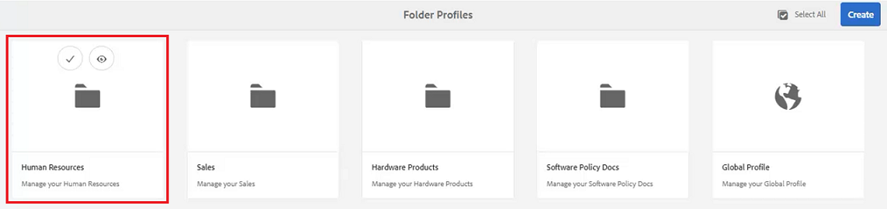

1. Selecteer **Algemeen** tab.

1. Klikken [!UICONTROL **Bewerken**] links boven in het scherm.

1. Selecteer onder Admin-gebruikers een gebruiker in het vervolgkeuzemenu of typ de naam van een gebruiker.

1. Klikken [!UICONTROL **Toevoegen**].

   U kunt desgewenst meerdere Admin-gebruikers toevoegen.

   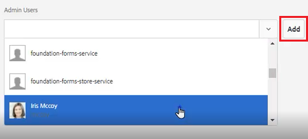

1. Klikken [!UICONTROL **Opslaan**] in de rechterbovenhoek van het scherm als alle gebruikers zijn toegevoegd.

Administratieve gebruikers worden nu toegewezen aan dit profiel.

## Een nieuw publiek toevoegen via het tabblad Voorwaardelijke kenmerken

Zodra u het Globale Profiel hebt betreden kunt u zijn configuratie uitgeven. De instellingen voor het algemene profiel worden toegepast op alle gebruikers, tenzij anders aangegeven.

1. Selecteer vanuit het gewenste mapprofiel de optie **Voorwaardelijke kenmerken** tab.

1. Klikken [!UICONTROL **Bewerken**] in de linkerbovenhoek van het scherm.

   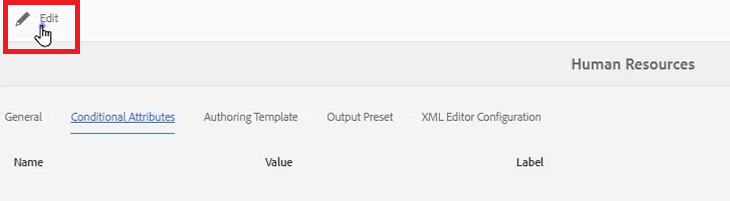

1. Klikken [!UICONTROL **Toevoegen**].

1. Vul de **Naam**, **Waarde**, en **Label** velden voor de nieuwe voorwaarde.

   Klik op de knop [!UICONTROL **Plus**] Met sign kunt u extra waarde- en labelparen toevoegen voor het benoemde kenmerk.

   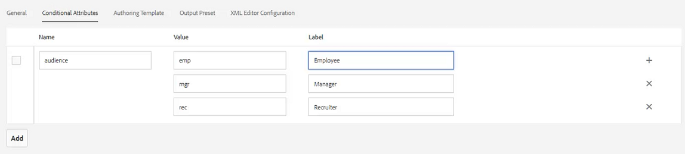

1. Klikken [!UICONTROL **Opslaan**] in de linkerbovenhoek van het scherm.

De nieuwe voorwaardelijke kenmerken zijn toegevoegd aan dit profiel.

## Kies een sjabloon en een kaart op het tabblad Ontwerpsjablonen

AEM Hulplijnen worden geleverd met ontwerpsjablonen en -kaarten die niet in de box staan. U kunt deze beperken tot specifieke auteurs. Standaard worden de sjablonen opgeslagen op de middelenlocatie in de map DITA-sjablonen.

1. Selecteer het tabblad Ontwerpsjablonen in het gewenste mapprofiel.

1. Klik op Bewerken in de linkerbovenhoek van het scherm.

1. Voeg een Kaartsjabloon toe.

   a. Van de **Kaartsjablonen** selecteert u een optie in de beschikbare kaarten.

   b. Klikken [!UICONTROL **Toevoegen**].

   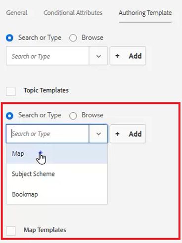

1. Voeg een onderwerpsjabloon toe.

   a. Van de **Onderwerpsjablonen** selecteert u een optie in de beschikbare sjablonen.

   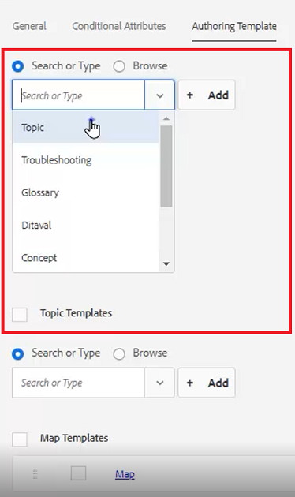

1. Klikken [!UICONTROL **Toevoegen**].

1. Voeg desgewenst aanvullende onderwerpsjablonen toe.

1. Als u klaar bent, klikt u op [!UICONTROL **Opslaan**] links boven in het scherm.

De nieuwe ontwerpsjablonen zijn toegevoegd aan dit profiel.

## Niet-essentiële voorinstellingen verwijderen op het tabblad Voorinstellingen voor uitvoer

U kunt elke uitvoervoorinstelling configureren op basis van het mapprofiel. Uitvoervoorinstellingen die niet nodig zijn, moeten worden verwijderd.

1. Selecteer vanuit het gewenste mapprofiel de optie **Voorinstellingen uitvoer** tab.

1. Schakel in het linkerdeelvenster de selectievakjes in van alle voorinstellingen die niet vereist zijn.

   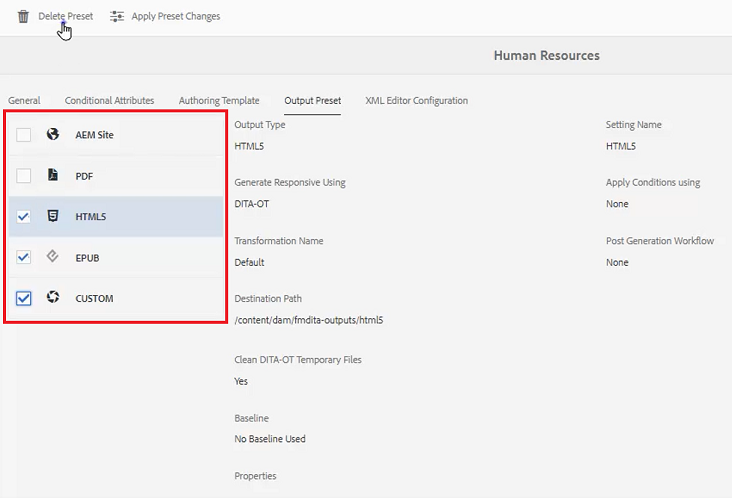

1. Klikken [!UICONTROL **Voorinstelling verwijderen**] in de linkerbovenhoek van het scherm.

1. Klik in het dialoogvenster Voorinstelling verwijderen op [!UICONTROL **Verwijderen**].

   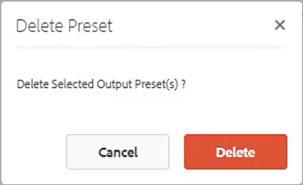

De enige voorinstellingen voor uitvoer die worden weergegeven, zijn de voorinstellingen die worden gebruikt.

## Een fragment uploaden vanaf het tabblad Configuratie van de XML-editor

1. Selecteer vanuit het gewenste mapprofiel de optie **XML Editor-configuratie** tab.

1. Klik onder Fragmenten van de XML-editor op [!UICONTROL **Uploaden**].

   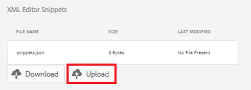

1. Navigeer naar een eerder gemaakt fragment.

1. Klikken [!UICONTROL **Openen**].

1. Klikken [!UICONTROL **Opslaan**] links boven in het scherm.

U hebt met succes de Configuratie van de Redacteur gewijzigd om Fragmenten op te nemen.

## Geef het mapprofiel op in de opslagplaats

In de Editor ziet u de resultaten van de wijzigingen die u hebt aangebracht in de mapprofielen.

1. Navigeren naar **Weergave opslagplaats**.

1. Klik op de map voor de inhoud waarmee u wilt werken.

1. Klik op de knop [!UICONTROL **Gebruikersvoorkeuren**] op de bovenste werkbalk.

   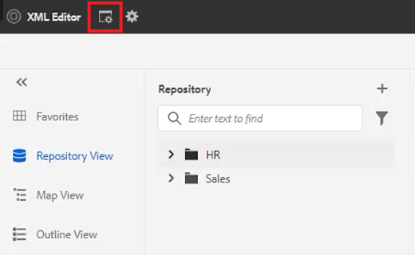

1. Selecteer in het dialoogvenster Gebruikersvoorkeuren het gewenste mapprofiel in het vervolgkeuzemenu.

   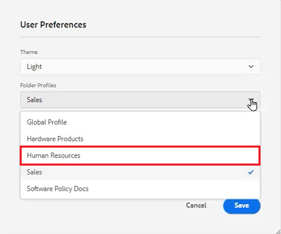

1. Klikken [!UICONTROL **Opslaan**].

U hebt het mapprofiel toegepast op uw inhoud. Nu, wanneer u een nieuw onderwerp DITA creeert, zult u een beperkte lijst van onderwerptypes zien die op het Profiel van de Omslag wordt gebaseerd. De voorwaarde van het publiek bevat de Globale montages evenals die specifiek voor het Profiel van de Omslag. In het geüploade fragmentbestand is een set standaardfragmenten gemaakt waaruit u kunt kiezen. Op het dashboard Kaart worden de beperkte uitvoervoorinstellingen weergegeven.
