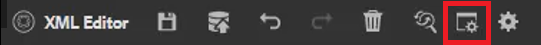

# Verklarende woordenlijst

In het deelvenster Verklarende woordenlijst kan een kaart worden geparseerd. U kunt een het onderwerpdossier van de Verklarende woordenlijst tot stand brengen en het omvatten in een gemeenschappelijke afbeelding van de Verklarende woordenlijst. Deze kaart kan vervolgens aan andere kaarten worden toegevoegd. Met de verklarende woordenlijst is het eenvoudiger om informatie consistent te formuleren en de lezer meer duidelijkheid te verschaffen.

Voorbeeldbestanden die u voor deze les wilt gebruiken, staan in het bestand [glossary.zip](assets/glossary.zip).

>[!VIDEO](https://video.tv.adobe.com/v/342765?quality=12&learn=on)

## Voeg een verklarende woordenlijstingang aan een onderwerp toe

1. Ga naar de **Verklarende woordenlijst** deelvenster.

2. Sleep de vermelding vanuit de **Verklarende woordenlijst** aan de gewenste plaats in uw onderwerp.

Als de kaart de ingangen van de Verklarende woordenlijst bevat en behoorlijk gevormd, kunnen de onderwerpen automatisch worden bijgewerkt om afgekorte vorm te bevatten.

## Een hoofdmap opgeven

De correcte Kaart van de Wortel moet worden geselecteerd om behoorlijk met een verklarende woordenlijst te werken. Wanneer een Kaart van de Wortel de Berichten van de Verklarende woordenlijst vindt, worden zij getoond in het paneel van de Verklarende woordenlijst.

1. Als er een onderwerp is geopend, selecteert u **Verklarende woordenlijst** in het linkerdeelvenster.

2. Klik op de knop [!UICONTROL **Gebruikersvoorkeuren**] op de bovenste werkbalk.

   

3. Klik op het sleutelpictogram om de juiste hoofdmap op te geven voor het werken met de verklarende woordenlijst.

4. Klikken [!UICONTROL **Selecteren**].

5. Klikken [!UICONTROL **Opslaan**].

Het deelvenster Verklarende woordenlijst wordt automatisch bijgewerkt.

## Werken met de woordenlijst

1. Ga naar de **Weergave opslagplaats**.

2. Selecteer de kaart die vooraf is gevormd om met de verklarende woordenlijst te werken.

   

3. Kies de optie [!UICONTROL **Kaartweergave**].

4. Verifieer dat de Mening van de Kaart de vereiste onderwerpen toont.

## Een voorbeeld van een woordenlijst weergeven

Omdat het mogelijk is om bulkveranderingen aan te brengen, kan het belangrijk zijn om een verklarende woordenlijst voorproef.

1. Kies **Verklarende woordenlijst** in het linkerdeelvenster.

2. Klik op het contextmenu naast een woordenlijst en selecteer [!UICONTROL **Voorvertoning**].

Zowel het afgekorte formulier als de verklarende woordenlijstdefinitie worden weergegeven.

## Instellingen Hotspot controleren

Met het gereedschap Hotspot kunt u een hele verzameling verklarende woordenlijstitems maken op basis van één kaart. U kunt zelfs specifieke teksttermen zoeken en converteren naar gekoppelde verklarende woordenlijstafkortingen.

1. Selecteer in het deelvenster Verklarende woordenlijst de optie [!UICONTROL **Hotspot-pictogram**].

   

2. Klik op de knop [!UICONTROL **Verklarende sleutels**] en selecteert u alleen de toetsen die u wilt toepassen.

3. Klik op de knop [!UICONTROL **Onderwerpen**] vervolgkeuzelijst om de inhoud te selecteren die moet worden beïnvloed.

4. Klik op de knop [!UICONTROL **Onderwerpen filteren op status**] vervolgkeuzelijst voor het controleren van geconfigureerde opties.

5. Configureer de overige instellingen naar wens.

6. Als u klaar bent, klikt u op [!UICONTROL **Omzetten**].

In het deelvenster Verklarende woordenlijst worden nu alle bijgewerkte onderwerpen en ook onderwerpen met fouten weergegeven.
