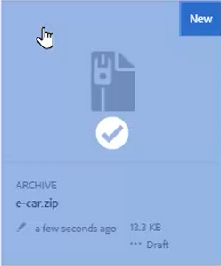
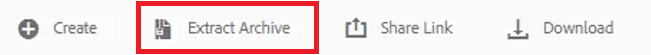
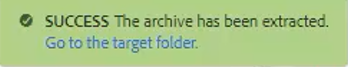
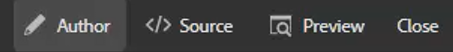
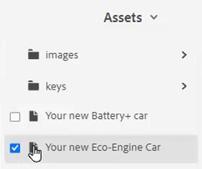
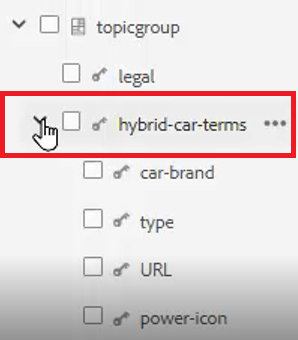
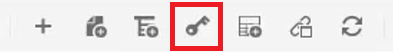
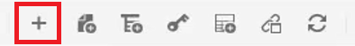
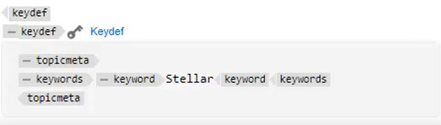

# Toetsen

Verschillende materiaalsets kunnen vergelijkbare informatie bevatten die op bepaalde plaatsen moet worden aangepast. De sleutels staan u toe om veranderlijke informatie aan te omvatten wanneer het werken met DITA.

Voorbeeldbestanden die u voor deze les wilt gebruiken, staan in het bestand [keys.zip](assets/keys.zip).

>[!VIDEO](https://video.tv.adobe.com/v/342756?quality=12&learn=on)

## Toetsen inschakelen

1. Upload de set met beschikbare voorbeeldbestanden.

   a. Laad het ZIP-bestand.

   b. Vernieuw de AEM.

   c. Selecteer het bestand voor extractie.

   

   d. Klikken [!UICONTROL **Archief extraheren**] in de bovenste werkbalk.

   

   e. Kies in het dialoogvenster de specifieke locatie voor bestanden die u wilt uitpakken, zoals een map met de naam Toetsen.

   f. Klikken [!UICONTROL **Volgende**].

   g. Sla eventuele conflicten over omdat deze niet bestaan voor inhoud die nog niet eerder is geüpload.

   h. Selecteren [!UICONTROL **Extraheren**] aan de rechterbovenhoek van het scherm.

1. Wanneer het uitpakken is voltooid, klikt u op [!UICONTROL **Ga naar de doelmap**].

   

## Toetsen omzetten in waarden waarnaar wordt verwezen

Om sleutels correct te gebruiken, moet de Voorkeur van de Gebruiker een specifieke kaart als Kaart van de Wortel van verwijzingen voorzien. Binnen deze kaart is een inzameling van Sleutels, die samen binnen een topicgroep wordt gegroepeerd. Als u de kaart opent en de onderwerpen opent, worden de Toetsen omgezet in de waarden waarnaar deze kaart verwijst.

1. Geef een hoofdmap op.

   a. Open een kaart vanuit het scherm Toetsen.

   b. Gebruikersvoorkeuren configureren.

   c. Klik op de knop [!UICONTROL **Gebruikersvoorkeuren**] op de bovenste werkbalk.

   

   d. Klik op het sleutelpictogram om een **Hoofdmap** die wordt gebruikt om Toetsen op te lossen.

   e. Schakel de selectievakjes voor de gewenste elementen in.

   

   f. Klikken [!UICONTROL **Selecteren**].

   g. **Opslaan** de Voorkeuren van de Gebruiker.

1. Ga naar de **Kaartweergave**.

1. Open de opgegeven kaart.

De sleutels worden opgelost.

## Handmatig een nieuw sleutelbestand toevoegen

1. Open een kaart met een opgegeven hoofdmap.

1. Selecteer een toets.

   

1. Voeg een nieuw sleutelwoord in.

   a. Klik op een geldige locatie op de kaart.

   b. Selecteer **Keydef** op de bovenste werkbalk.

   

   c. Voer in het dialoogvenster Keydef invoegen een unieke waarde in voor Toetsen die voor de definitie die u maakt, zinnig is.

   d. Klikken [!UICONTROL **Invoegen**].

1. Voeg topicmeta binnen keydef toe.

   a. Klik op de knop [!UICONTROL **Element invoegen**] op de bovenste werkbalk.

   

   b. Zoek en selecteer &#39;topicmeta&#39; in het dialoogvenster Element invoegen.

1. Voeg sleutelwoorden binnen topicmeta toe.

   a. Klik op de knop [!UICONTROL **Element invoegen**] op de bovenste werkbalk.

   

   b. Zoek in het dialoogvenster Element invoegen naar &quot;trefwoorden&quot; en selecteer deze.

1. Voeg een sleutelwoord binnen topicmeta toe.

   a. Klik op de knop [!UICONTROL **Element invoegen**] op de bovenste werkbalk.

   

   b. In de **Element invoegen** , zoekt en selecteert u &quot;trefwoord&quot;

1. Typ de waarde voor het trefwoord in het trefwoord.

Op de kaart zou uw keydef er nu ongeveer als volgt moeten uitzien:

## Een sleuteldefinitie configureren als een fragment

Fragmenten zijn kleine inhoudsfragmenten die over verschillende onderwerpen in uw documentatieproject opnieuw kunnen worden gebruikt. In plaats van handmatig elk sleuteldef te genereren, kunt u één enkel sleuteldef configureren als een fragment.

1. Selecteer een keydef-element op de kaart.

1. Klik in het contextmenu op [!UICONTROL **Fragment maken**].

1. Voeg een titel en beschrijving toe in het dialoogvenster Nieuw fragment.
U kunt ook bestaande toetsen of trefwoorddefinities uit de inhoud verwijderen.

1. Klikken [!UICONTROL **Maken**].

1. Selecteer in het linkerdeelvenster de optie **Fragmenten**.

1. Sleep het fragment dat u zojuist hebt gemaakt van het deelvenster Fragmenten naar de kaart.

1. Werk het toetsontwerp zo nodig bij met de eigenschappen van de inhoud.
Wanneer bewaard en verfrist, zal deze reeks Sleutels voor om het even welke gebruiker beschikbaar zijn die een kaart heeft bepaald die de zelfde Kaart van de Wortel bevat.
