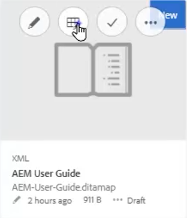
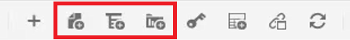
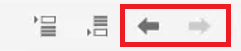
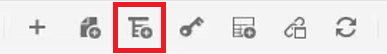
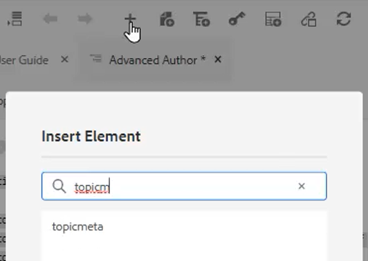
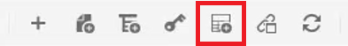
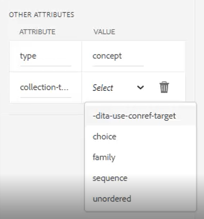

# Kaarten en bladwijzers

Met de Kaarteditor van Adobe Experience Manager-hulplijnen kunt u kaartbestanden maken en bewerken. Met behulp van de Kaarteditor kunt u twee typen bestanden bewerken: DITA-kaart en bladmap. Voor ons zijn deze grotendeels onderling verwisselbare concepten.
De Kaarteditor bestaat uit twee modi: de Basis Kaarteditor en de Geavanceerde Kaarteditor.

>[!VIDEO](https://video.tv.adobe.com/v/342766?quality=12&learn=on)

## Een kaart maken

AEM de Gidsen verstrekt twee uit-van-de-doos kaartmalplaatjes - kaart DITA en bookmap. U kunt ook uw eigen kaartsjablonen maken en deze delen met uw auteurs om kaartbestanden te maken.

Voer de volgende stappen uit om een kaartbestand te maken.

1. Navigeer in de interface Elementen naar de locatie waar u het kaartbestand wilt maken.

2. Klikken [!UICONTROL **Maken > DITA-toewijzing**].

3. Selecteer op de pagina Vervagen het type kaartsjablonen dat u wilt gebruiken en klik op [!UICONTROL **Volgende**].

4. Voer op de pagina Eigenschappen een **Titel** en **Naam** voor de kaart.

5. Klikken [!UICONTROL **Maken**].

## Een kaart openen met de Geavanceerde Kaarteditor

1. In de **UI Middelen** selecteert u de kaart die u wilt bewerken.

2. Klikken [!UICONTROL **Onderwerpen bewerken**].

   

of

1. Houd de muis boven het kaartpictogram.

2. Selecteren **Onderwerpen bewerken** van de **Handeling** -menu.

## Inhoud toevoegen aan een kaart of bladwijzer

1. Ga naar de **Weergave opslagplaats**.

2. Sleep inhoud van de Weergave opslagplaats naar geldige locaties op de kaart of de boekkaart.

of

1. Klik op een geldige locatie op de kaart of de bladwijzer.

2. Klik op de juiste [!UICONTROL **Werkbalkpictogram**] om hoofdstukken, onderwerpen, of topicrefs toe te voegen.

   

3. Kies een of meer elementen die u wilt toevoegen.

4. Klikken [!UICONTROL **Selecteren**].

### Elementen in een kaart bevorderen of degraderen

Gebruiken **Werkbalkpijlen** om hoofdstukken en onderwerpen in een kaart of een boekenkaart te bevorderen of te degraderen.

1. Selecteer een element op de kaart.

2. Klik op de knop [!UICONTROL **Pijl-links**] om een topicref aan een hoofdstuk te bevorderen, of [!UICONTROL **Pijl-rechts**] om een hoofdstuk aan een topicref te degraderen.

   

3. Sla de kaart op en verander deze indien nodig.

of

1. Sleep elementen om ze opnieuw te ordenen.

## Metagegevens toevoegen aan een kaart

1. Van de **Werkbalk Kaart**, voeg een topicgroep in.

   

2. Klik op de knop [!UICONTROL **Pictogram Plus**] om elementen in te voegen.

3. Kies de elementen die u wilt invoegen.

   

4. Klikken [!UICONTROL **Sluiten**].

## Een reltable toevoegen aan een kaart

Een reltable kan worden toegevoegd nadat een kaart is gestructureerd.

1. Klik op de kaart waar u de reltable wilt invoegen.

2. Gebruik de **Werkbalkpictogram** om de reltable aan de kaart toe te voegen.

   

3. Configureer het dialoogvenster.

4. Klikken [!UICONTROL **Invoegen**].

5. Vereiste onderwerpen slepen en neerzetten vanuit de **Bewaarplaats** in de reltable.

6. Kopieer en plak de vereiste elementen van de kaart naar de reltable met behulp van standaardsneltoetsen.

## Kenmerken toewijzen aan onderwerpen in een kaart

1. Benadruk een topicref of genestelde inzameling van topicrefs in de kaart.

2. Kies onder Andere kenmerken in het deelvenster Eigenschappen van inhoud de optie **Kenmerk** en **Waarde.**

   
