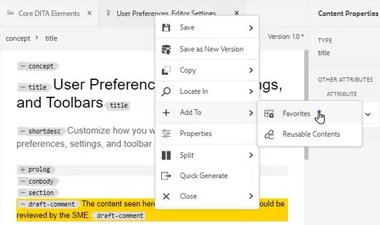
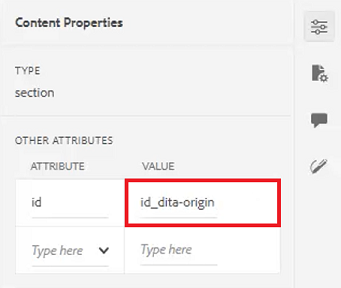
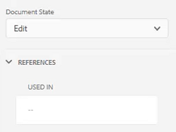

# Deelvensters

De webeditor voor AEM hulplijnen bestaat uit meerdere secties, waaronder een hoofdwerkbalk, een secundaire werkbalk, een linkerdeelvenster, een bewerkingsgebied voor inhoud en een rechterdeelvenster.

>[!VIDEO](https://video.tv.adobe.com/v/342760)

## Het formaat van het linkerdeelvenster wijzigen

Blijvende deelvensters, zoals het linkerdeelvenster, kunnen in grootte worden aangepast.

1. Plaats de cursor op de vensterrand.

2. Wanneer de dubbele pijl verschijnt, klikt u en sleept u naar binnen of naar buiten.

## De linkerzijbalk van het deelvenster uitvouwen of samenvouwen

In de uitgevouwen weergave worden de namen en pictogrammen weergegeven die als knopinfo worden weergegeven in de samengevouwen weergave.

1. Klik op de knop [!UICONTROL **Zijbalk**] om het deelvenster uit te vouwen.

   

2. Klik op de knop [!UICONTROL **Zijbalk**] weer om het deelvenster samen te vouwen.

   

## Een verzameling Favorieten maken

In het linkerdeelvenster kunt u met Favorieten een lijst met specifieke documenten maken en deze in de loop der tijd toevoegen. U kunt een brede inzameling van Favorieten tot stand brengen en beheren.

1. Selecteren **Favorieten** in het linkerdeelvenster.

2. Klik op de knop [!UICONTROL **Plus**] pictogram.

   

3. Voer in het dialoogvenster Nieuwe verzameling een **Titel** en **Beschrijving**.

   Houd er rekening mee dat als u Openbaar selecteert, andere gebruikers deze favoriet kunnen zien.

4. Klikken [!UICONTROL **Maken**].

U hebt nu een verzameling Favorieten gemaakt.

## Een bestand toevoegen aan een verzameling Favorieten uit de opslagplaats

Nadat u een verzameling hebt gemaakt, kunt u beginnen met het toevoegen van Favorieten.

1. Selecteren **Weergave opslagplaats** in het linkerdeelvenster.

2. Klik op de knop [!UICONTROL **Weglatingsteken**] naast een onderwerp voor toegang tot contextafhankelijke opties.

3. Selecteren **Toevoegen aan** > **Favorieten**.

4. Kies in het dialoogvenster Toevoegen aan Favorieten de optie **Nieuwe verzameling** of **Bestaande verzameling**.

   Hier, zullen wij verkiezen om aan een Bestaande Inzameling toe te voegen.

   

5. Selecteer indien nodig een verzameling in het vervolgkeuzemenu.

6. Klikken [!UICONTROL **Toevoegen**].

Het onderwerp wordt toegevoegd aan de inzameling van Favorieten u koos. U kunt deze weergeven in het menu Favorieten.

## Een bestand toevoegen aan een verzameling Favorieten uit de Editor

Een andere manier om een onderwerp aan uw Favorieten toe te voegen is van een open onderwerp in de Redacteur.

1. Ga naar de **Weergave opslagplaats**.

2. Dubbelklik op een onderwerp om het te openen.

3. Klik met de rechtermuisknop op de **Tabblad Titel** in de Editor voor toegang tot contextafhankelijke opties.

4. Kies **Toevoegen aan** > **Favorieten**.

   

5. Kies in het dialoogvenster Toevoegen aan Favorieten de optie **Nieuwe verzameling** of **Bestaande verzameling**.

   Hier, zullen wij verkiezen om aan een Nieuwe Inzameling toe te voegen.

6. Voer in het dialoogvenster Nieuwe verzameling een **Titel** en **Beschrijving**.

   Houd er rekening mee dat u **Openbaar** betekent dat andere gebruikers deze favoriet kunnen zien.

7. Klikken [!UICONTROL **Maken**].

De nieuwe favoriet is gemaakt en gegroepeerd. U kunt deze weergeven in het menu Favorieten.

## Uw favorieten weergeven en beheren

Het is gemakkelijk om te bekijken welke onderwerpen u reeds aan uw Inzamelingen van Favorieten hebt toegevoegd.

1. Selecteren [!UICONTROL **Favorieten**] in het linkerdeelvenster.

2. Klik onder Favorieten op de knop [!UICONTROL **Pijl**] pictogram naast een verzameling om de inhoud ervan weer te geven.

   

3. Klik op de knop [!UICONTROL **Weglatingsteken**] naast een onderwerp om contextuele opties, met inbegrip van de optie te tonen om het van de lijst van Favorieten te schrappen.

## Een zoekopdracht filteren in de weergave Opslagplaats

Met het verbeterde filter in de opslagplaats kunt u zoeken naar tekst met een groot aantal beperkingen.

1. Navigeren naar **Weergave opslagplaats**.

2. Klik op de knop [!UICONTROL **Filter Zoeken**] pictogram.

   

3. Typ tekst in het geselecteerde pad of kies indien nodig een nieuw pad.

   De lijst met bestanden wordt bijgewerkt terwijl u tekst in het filter typt.

4. Klik op het pijlpictogram naast een zoekcategorie om de zoekopdracht indien nodig verder te beperken.

   

Zoekopdrachten kunnen worden beperkt tot DITA-onderwerpen of DITA-kaarten. U kunt zoeken in niet-DITA-afbeeldingsbestanden, multimedia of andere documenten in het geselecteerde pad. U kunt de zoekopdracht zelfs beperken tot DITA-elementen of filteren door het uitchecken van bestanden.

## De Kaartweergave verkennen

In de Kaartweergave zijn verschillende nuttige functies beschikbaar, zoals de mogelijkheid om bestanden uit te checken en te vergrendelen, een voorvertoning van het kaartbestand weer te geven, het Kaartdashboard te openen en de kaart weer te geven in de interface Middelen.

Zie de les met de titel [Kaarten en bladwijzers](./maps-and-bookmaps.md) in deze cursus voor meer informatie over de Kaartweergave en de functionaliteit ervan.

## De omtrekweergave verkennen

De mening van het Overzicht verstrekt een hiërarchische mening van het huidige document in het Overzicht. U kunt de mening van het Overzicht uitbreiden om veelvoudige elementen evenals om het even welke toegewezen IDs te tonen.

Zie de les met de titel [Omtrekweergave](./outline-view.md) in deze cursus voor meer informatie over de mening van het Overzicht en zijn functionaliteit.

## Werken met herbruikbare inhoud

De kernDITA eigenschap is de capaciteit om inhoud, van kleine uitdrukkingen aan volledige onderwerpen of kaarten opnieuw te gebruiken. De Editor biedt een interface voor slepen en neerzetten voor hergebruik van inhoud.

Zie de les met de titel [Inhoud opnieuw gebruiken](./content-reuse.md) in deze cursus voor meer informatie over herbruikbare inhoud en hoe u deze effectief kunt beheren.

## Werken met woordenlijsten

Met de verklarende woordenlijst is het eenvoudiger om informatie consistent te formuleren en de lezer meer duidelijkheid te verschaffen. De Redacteur verstrekt belemmering-en-dalingsinterface voor het opnemen van verklarende woordenlijsttermijnen in een onderwerp.

Zie de les met de titel [Verklarende woordenlijst](./glossary.md) in deze cursus voor meer informatie over het vormen van en het gebruiken van verklarende woordenlijsten.

## Werken met voorwaarden

In DITA, worden de voorwaarden vaak gedreven door het gebruik van attributen zoals Product, Platform, en Publiek, die elk specifieke waarden kunnen hebben die aan hen worden toegewezen. De voorwaarden worden beheerd door de Profielen van de Omslag.

Zie de les met de titel [Voorwaarden](./conditions.md) in deze cursus voor meer informatie over het configureren en gebruiken van voorwaardelijke kenmerken.

## Een fragment maken

Fragmenten zijn kleine inhoudsfragmenten die opnieuw kunnen worden gebruikt als beginpunt voor inhoud of structuur. Het gebruik van fragmenten verkort de tijd die nodig is om inhoud te maken en verbetert de structurele kwaliteit en consistentie van de materialen.

1. Open een onderwerp in de Redacteur.

2. Selecteer een element binnen het onderwerp.

3. Klik op de secundaire muisknop in het element.

4. Kies in het resulterende menu de optie Maken [!UICONTROL **Fragment**].

   

5. Voeg in het dialoogvenster Nieuw fragment een **Titel** en **Beschrijving**.

6. Bewerk het fragment naar wens.

   Een contextafhankelijke controle geeft een visuele melding als u een fout in de inhoud invoert.

7. Klikken [!UICONTROL **Maken**].

Het fragment wordt toegevoegd aan de lijst met beschikbare fragmenten. Het is klaar om in een geldige plaats in het onderwerp worden gesleept en worden gelaten vallen.

## Werken met sjablonen

Met behulp van het deelvenster Sjablonen kunnen beheerders eenvoudig sjablonen voor auteurs maken en beheren. Door gebrek, zijn de malplaatjes gecategoriseerd als Kaart en onderwerp-type.

Raadpleeg de geleerde lessen [Mapprofielen](./folder-profiles.md) en [Workflows voor het maken van eenvoudige inhoud](simple-content-creation-workflows.md) in deze cursus voor meer informatie over het configureren en toepassen van sjablonen.

## Bestanden zoeken met Zoeken en vervangen

Er zijn twee opties voor Zoeken en Vervangen beschikbaar in de Editor. De eerste functie staat Zoeken en vervangen toe binnen een specifiek open onderwerp, net als een traditionele tekstverwerker. Het tweede is een deelvenster Zoeken en vervangen waarin wordt gezocht naar tekst in meerdere bestanden in de opslagplaats.

Zie de les met de titel [Spellingcontrole en Zoeken en vervangen](./spell-check.md)  in deze cursus voor meer informatie over de functie Zoeken en vervangen.

## Eigenschappen van inhoud bijwerken

De Eigenschappen van de inhoud op het juiste paneel omvat specifieke informatie over het momenteel geselecteerde element, bijvoorbeeld identiteitskaart van Attributen en Waarde.

1. Een onderwerp openen in **XML-editor**.

2. Selecteer een **element**.

   Met Eigenschappen van inhoud worden het huidige type en de huidige kenmerken van het element weergegeven.

3. Typ een nieuwe **Waarde** voor het element.

   

De eigenschappen van de inhoud worden dynamisch bijgewerkt wanneer u elementen wijzigt.

## Een onderwerp toevoegen aan een kaart met gebruik van Bestandseigenschappen

De Eigenschappen van het dossier toont extra informatie over het volledige open onderwerp. Sommige van deze informatie wordt gecontroleerd door de Eigenschappen van het Onderwerp. Wijzigingen in ander materiaal, zoals de documentstatus, kunnen afhankelijk zijn van machtigingen.

1. Open een onderwerp in de Redacteur.

2. Klik op de knop [!UICONTROL  **Bestandseigenschappen**] in het rechterdeelvenster.

   

3. Stel de **Documentstatus** tot **Bewerken**. De lijst Verwijzingen is momenteel leeg.

   

4. Sluit het onderwerp.

5. Selecteren [!UICONTROL **Weergave opslagplaats**] in het linkerdeelvenster.

6. Open een kaart.

   De weergave verandert in Kaartweergave.

7. Klik op de knop [!UICONTROL **Bewerken**] pictogram.

   

8. Als de kaart is geopend voor bewerken, schakelt u terug naar **Weergave opslagplaats**.

9. Sleep het onderwerp waarmee u werkt naar de kaart.

10. Klik op de knop [!UICONTROL **Opslaan**] op de bovenste werkbalk.

Het onderwerp wordt toegevoegd aan de kaart. Nu wanneer u het onderwerp opent en de Eigenschappen van het Dossier controleert, kunt u de Verwijzingen zien worden bijgewerkt om erop te wijzen dat het onderwerp in de gespecificeerde kaart wordt gebruikt.

## Revisietaak maken

Het rechterdeelvenster bevat een sneltoets waarmee u een revisiewerkstroom kunt starten.

1. Klik op de knop [!UICONTROL **Controleren**] in het rechterdeelvenster.

   

2. Klikken [!UICONTROL **Revisie maken**].

   

3. Vul de velden naar wens in in het dialoogvenster Revisietaak maken.

4. Klik op [!UICONTROL **Next**].

De Revisietaak wordt gemaakt.

## Wijzigingen bijhouden

De capaciteit om veranderingen te volgen geeft u heel wat controle over welke veranderingen in één versie van een onderwerp aan volgende worden behouden. U kunt het juiste deelvenster gebruiken om bijgehouden wijzigingen te beheren.

Zie de les met de titel [Wijzigingen bijhouden](./track-changes.md) in deze cursus voor meer informatie over de functie Wijzigingen bijhouden.
