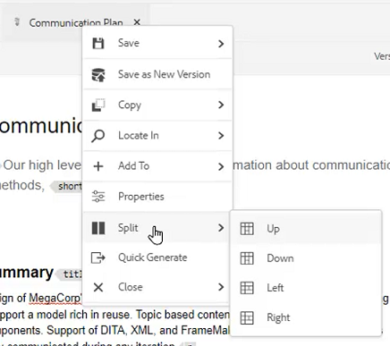

# Workflows voor het maken van eenvoudige inhoud

De AEM-editor voor hulplijnen heeft meerdere sneltoetsen die de workflow voor het maken van inhoud vereenvoudigen. Met deze sneltoetsen kunnen gebruikers snel afbeeldingen toevoegen en wijzigen, met meerdere onderwerpen tegelijk werken, fouten corrigeren, onderwerpen downloaden en met versies en labels werken.

>[!VIDEO](https://video.tv.adobe.com/v/342770)

## Een afbeelding toevoegen

Afbeeldingen kunnen rechtstreeks vanaf een lokaal station worden toegevoegd.

1. Sleep de afbeelding rechtstreeks naar het onderwerp. De **Elementen uploaden** wordt weergegeven.

   

2. Wijzig het mappad naar de gewenste afbeeldingslocatie.

3. Wijzig de naam van de afbeelding in een naam die representatief is voor het doel.

4. Klikken [!UICONTROL **Uploaden**].

## Een afbeelding wijzigen

1. Wijzig de grootte van een afbeelding door een hoek te slepen en neer te zetten.

2. Verplaats een afbeelding naar een andere locatie in het onderwerp door deze te slepen.

3. Gebruiken **Eigenschappen van inhoud** in het rechterdeelvenster om de

   - schalen

   - position

   - uitlijning, of

   - andere kenmerken.

   

## Werken met meerdere onderwerpen

De gesplitste Mening is nuttig wanneer het vergelijken van onderwerpen, het kopiëren en het kleven tussen onderwerpen, of het slepen van en het laten vallen van inhoud van één onderwerp aan een andere.

1. Open twee of meer verwante onderwerpen.

2. Klik op het tabblad Titel van een bestand om het contextmenu te openen.

3. Selecteren [!UICONTROL **Splitsen**].

4. Kies **Rechts**.

   

## Typische fouten corrigeren

1. Zoek het woord of de woordgroep met de fout.

2. Pers en greep [!UICONTROL **Ctrl**].

3. Klik op de secundaire muisknop op de fout.

4. Selecteer de juiste spelling.

De fout is verbeterd in de onderwerptekst.

## Een onderwerp-PDF downloaden

Gebruikers kunnen een PDF van het huidige onderwerp downloaden om het onderwerp aan te duiden of met anderen te delen.

1. Klikken [!UICONTROL **Voorvertoning**] aan de rechterbovenhoek van het scherm.

2. Klik op de knop [!UICONTROL **PDF-pictogram**] boven het onderwerp. Er wordt een dialoogvenster weergegeven.

   

3. Vul de gegevens in voor: **Transformatienaam** of **Argumenten DITA-OT-opdrachtregel** indien nodig. Een PDF wordt nog steeds gegenereerd als alle velden leeg blijven.

4. Klikken [!UICONTROL **Downloaden**]. De PDF genereert.

5. Gebruik beschikbare pictogrammen om het onderwerp van de PDF te vormen, te downloaden of te delen.

## Een onderwerp zoeken in de opslagplaats of op de kaart

1. Open het onderwerp.

2. Klik op de secundaire muisknop op het tabblad Titel.

3. Selecteren **Zoeken in**.

4. Kies **Bewaarplaats** of **Kaart** om naar de gewenste onderwerpplaats te springen.

## Versie een onderwerp

1. Wijzig een onderwerp.

2. Sla het onderwerp op.

3. Klik op de knop **Bewaarplaats** in het menu linksboven.

   

4. In het dialoogvenster voegt u **Opmerkingen voor nieuwe versie**.

   

5. Klikken [!UICONTROL **Opslaan**].

Het versienummer wordt bijgewerkt.

## Versielabels laden

Het proberen om de staat van een onderwerp te volgen die op slechts het Aantal van de Versie wordt gebaseerd kan moeilijk zijn. De etiketten maken het gemakkelijker om de nauwkeurige staat van een onderwerp te identificeren dat veelvoudige herzieningen heeft ondergaan.

1. Selecteer een **Mapprofiel**.

2. Configureer de XML-editor in het Mapprofiel.

   a. Selecteer Bewerken linksboven in het scherm.

   b. Onder de Etiketten van de Versie van de Inhoud van XML, of voeg een nieuw onderwerp toe of gebruik bestaande.

   

3. Selecteren [!UICONTROL **Uploaden**].

4. Kies een bestand zoals RevisieLabels.json of een vergelijkbaar bestand. Details over het maken van een dergelijk bestand vindt u in een andere video.

5. Klikken [!UICONTROL **Openen**].

6. Klikken [!UICONTROL **Opslaan**] links boven in het scherm Mapprofiel.

7. Klikken [!UICONTROL **Sluiten**] rechtsboven.

Versielabels worden nu geladen.

## Versielabels toewijzen

1. Versielabels laden.

2. Klik op de knop [!UICONTROL **Gebruikersvoorkeuren**] pictogram bij de bovenkant verlaten van het huidige onderwerp.

   

3. Selecteer hetzelfde mapprofiel waarin versielabels eerder zijn geladen.

4. Controleer in het dialoogvenster Gebruikersvoorkeuren of het basispad verwijst naar dezelfde gegevens waarop het mapprofiel is toegepast.

   

5. Klikken [!UICONTROL **Opslaan**].

6. Versie het onderwerp.

7. Voeg een opmerking toe en selecteer een versielabel in het vervolgkeuzemenu.

   

8. Klikken [!UICONTROL **Opslaan**].

Het versienummer wordt bijgewerkt.

## Versiegeschiedenis en labels weergeven

1. Zoek in het linkerdeelvenster de huidige onderwerptitel.

2. Klik op de titel om het contextmenu te openen.

3. Selecteren [!UICONTROL **Weergeven in interface Elementen**].

   

   - De versiegeschiedenis met labels wordt links weergegeven.

   

4. Klik op een versie om opties te openen zoals **Deze versie herstellen** en **Voorvertoning versie**.

## Een nieuwe sjabloon maken

Er bestaan sjablonen voor zowel onderwerpen als kaarten. Beheerders hebben toegang tot sjablonen in het linkerdeelvenster.

1. Klikken [!UICONTROL **Sjablonen**] in het linkerdeelvenster.

2. Selecteer Kaart of Onderwerp om het bijbehorende contextafhankelijke menu te openen.

3. Klik om de nieuwe sjabloon toe te voegen.

   

4. Vul de velden in het resulterende dialoogvenster.

De shell-sjabloon wordt weergegeven met voorbeeldinhoud en een voorbeeldstructuur.
