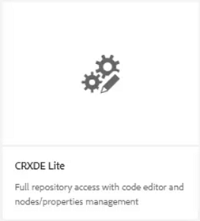
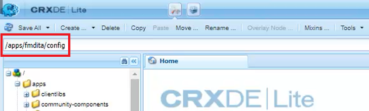
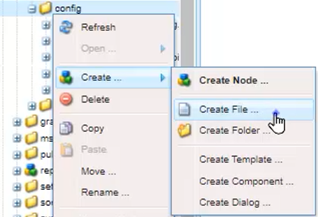
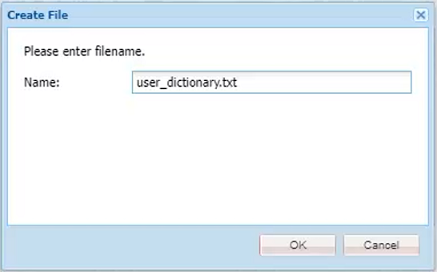
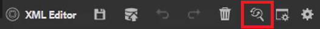
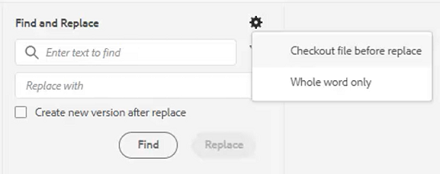
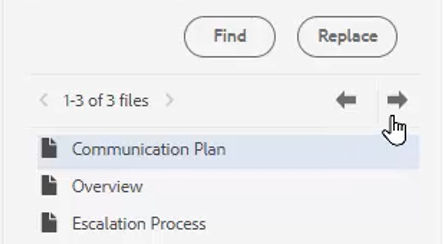

# Spellingcontrole en Zoeken/vervangen

De Editor voor AEM hulplijnen beschikt over krachtige mogelijkheden voor spellingcontrole en Zoeken en vervangen.

>[!VIDEO](https://video.tv.adobe.com/v/342768?quality=12&learn=on)

Een spelfout corrigeren

1. Zoek een fout in een open onderwerp, weergegeven met een rode onderstreping.

1. Houd Ctrl ingedrukt en klik op de secundaire muisknop in het woord.

1. Kies de juiste spelling in de suggesties.

Als de juiste spelling niet wordt voorgesteld, kunt u het woord altijd handmatig bewerken.

## Schakelen naar AEM spellingcontrole

U kunt een andere spellingcontrole dan het standaardwoordenboek van de browser gebruiken.

1. Navigeren naar **Editor-instellingen**.

1. Selecteer **Algemeen** tabblad Instellingen.

   

1. Er zijn twee opties:

   - **Spellingcontrole browser** — De standaardinstelling waarbij de spellingcontrole gebruikmaakt van het ingebouwde woordenboek van de browser.

   - **Spellingcontrole AEM** — gebruik dit om een lijst van het douanewoord te bouwen gebruikend AEM douanewoordenboek.

1. Kies **Spellingcontrole AEM**.

1. Klikken [!UICONTROL **Opslaan**].

Een aangepast woordenboek configureren

De beheerder kan de instellingen wijzigen zodat het AEM woordenboek aangepaste woorden zoals bedrijfsnamen herkent.

1. Ga naar de **Gereedschappen** venster.

1. Aanmelden bij **CRXDE Lite**.

   

1. Ga naar de **_/apps/fmdita/config-knooppunt_**.

   

1. Maak een nieuw bestand.

   a. Klik met de rechtermuisknop op de configuratiemap.

   b. Kies **Maken > Bestand maken**.

   

   c. Geef het bestand een naam _**user_dictionary.txt**_.

   

   d. Klikken [!UICONTROL **OK**].

1. Open het bestand.

1. Voeg een lijst met woorden toe die u in het aangepaste woordenboek wilt opnemen.

1. Klikken [!UICONTROL **Alles opslaan**].

1. Sluit het bestand.

Auteurs moeten mogelijk hun Web Editor-sessie opnieuw starten om de bijgewerkte lijst met aangepaste woorden in het AEM Woordenboek te krijgen.

## Zoeken en vervangen in één bestand

1. Klik op het pictogram Zoeken en vervangen op de bovenste werkbalk.

   

1. Typ een woord of woordgroep in de onderste werkbalk.

1. Klikken [!UICONTROL **Zoeken**].

1. Typ zo nodig een woord om het gevonden woord te vervangen.

1. Klikken [!UICONTROL **Vervangen**].

## Zoeken en vervangen in de hele opslagplaats

1. Ga naar de **Bewaarplaats**.

1. Klik op de knop [!UICONTROL **Zoeken en vervangen**] pictogram linksonder in het scherm.

1. Klik op de knop [!UICONTROL **Instellingen tonen**] pictogram.

1. Kies

   - **Bestand uitchecken vóór vervangen** — als dit is ingeschakeld door een beheerder, wordt het bestand automatisch uitgecheckt voordat zoektermen worden vervangen.

   - **Alleen hele woorden** — hiermee wordt de zoekopdracht beperkt tot het exacte ingevoerde woord of de exacte ingevoerde woordgroep.

   

1. Klik op de knop [!UICONTROL **Filter toepassen**] pictogram om het pad te selecteren in de opslagplaats waar u de zoekopdracht wilt uitvoeren.

1. Voer de voorwaarden in die u wilt zoeken en vervangen.

1. Selecteer indien nodig **Nieuwe versie maken na vervangen**.

1. Klikken [!UICONTROL **Zoeken**].

1. Open het gewenste bestand en gebruik de pijlen om van het ene gevonden resultaat naar het volgende te navigeren.

   
