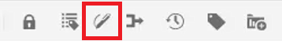
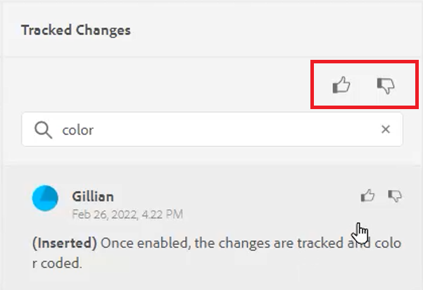
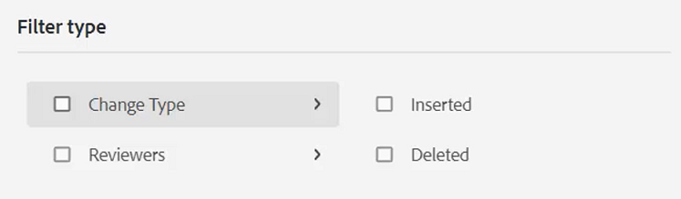
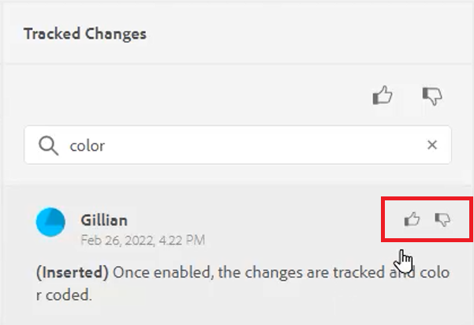
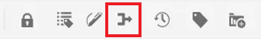

# Wijzigingen bijhouden

U kunt alle op een document aangebrachte updates bijhouden door de modus Wijzigingen bijhouden in te schakelen. In deze modus kunnen u en uw team alle invoegingen en verwijderingen vastleggen tijdens het revisieproces van het document.

>[!VIDEO](https://video.tv.adobe.com/v/342763)

## Werken met de functie Wijzigingen bijhouden

1. Schakelen tussen **Wijzigingen bijhouden** werkbalkpictogram om de functie in of uit te schakelen.

   

2. Wijzig het onderwerp.

   Toegevoegde inhoud wordt nu groen weergegeven met een wijzigingsbalk. Verwijderde inhoud wordt rood weergegeven met een doorhaling.

3. Selecteer **Bijgehouden wijzigingen** rechts in het deelvenster Bijgehouden wijzigingen.

   

4. Klikken [!UICONTROL **Opslaan**].

   

5. Sluit het onderwerp.

Andere gebruikers kunnen het onderwerp nu openen en de bestaande bijgehouden wijzigingen bekijken. Ze kunnen de wijzigingen accepteren of afwijzen en hun eigen wijzigingen toevoegen.

## Bijgehouden wijzigingen zoeken

De zoekfunctie is handig wanneer er veel bijgehouden wijzigingen zijn, omdat het tijdrovend doorbladeren ervan veel tijd in beslag kan nemen.

1. Selecteer **Bijgehouden wijzigingen** rechts in het deelvenster Bijgehouden wijzigingen.

2. Typ een woord of woordgroep in het veld Zoeken.
De zoekopdracht retourneert alle wijzigingen die overeenkomen met de zoekwoorden.

## Bijgehouden wijzigingen filteren

Meerdere bijgehouden wijzigingen kunnen ook worden gefilterd door invoegen, verwijderen of reviseren.

1. Klik op de knop [!UICONTROL **Filter**] onder aan het deelvenster Bijgehouden wijzigingen.

2. Schakel de selectievakjes voor de gewenste filters in.

   

3. Klikken [!UICONTROL **Toepassen**].

## Bijgehouden wijzigingen accepteren of negeren

Revisoren en deskundigen op het gebied van onderwerpen kunnen de wijzigingen van andere gebruikers afzonderlijk of in één keer accepteren of afwijzen.

1. Klik op de knop [!UICONTROL **Bijgehouden wijzigingen**] rechts in het deelvenster Bijgehouden wijzigingen.

2. Selecteer een specifieke wijziging.

3. Klik op de knop [!UICONTROL **Stompelen omhoog**] of [!UICONTROL **Miniatuur omlaag**] pictogram dat aan de wijziging is gekoppeld om deze te accepteren of te negeren.

   

   of

   Klik op de knop [!UICONTROL **Stompelen omhoog**] of [!UICONTROL **Miniatuur omlaag**] boven de zoekbalk om alle wijzigingen te accepteren of af te wijzen.

   

4. [!UICONTROL **Opslaan**] het onderwerp.

## Werken met de functie Samenvoegen

Wanneer u in een multi-auteurmilieu werkt, kan het moeilijk zijn om te volgen welke veranderingen andere auteurs in een onderwerp of kaart hebben aangebracht. Met de functie Samenvoegen hebt u meer controle over het weergeven van de wijzigingen, maar ook over de wijzigingen die in de meest recente versie van het document blijven staan.

1. Open een onderwerp in de Redacteur van het Web.

2. Klik op de knop [!UICONTROL **Samenvoegen**] op de werkbalk.

   

3. Selecteer in het dialoogvenster Samenvoegen een versie van het bestand waarmee u de huidige versie van het bestand wilt vergelijken.

4. Kies bij Opties de volgende opties:

   - **Wijzigingen bijhouden in geselecteerde versie**: Met deze optie worden alle inhoudsupdates weergegeven in de vorm van bijgehouden wijzigingen. Vervolgens kunt u kiezen of u de wijzigingen in het document een voor een of alle wijzigingen tegelijk wilt accepteren of negeren.

   - **Geselecteerde versie herstellen**: Met deze optie keert u de huidige versie van het document terug naar de geselecteerde versie. Het geeft u geen controle over de inhoud die wordt geaccepteerd of afgewezen.

5. Klikken [!UICONTROL **Gereed**].

Als u **Wijzigingen bijhouden van geselecteerde versie, optie** Vervolgens worden alle wijzigingen van de geselecteerde versie weergegeven op het tabblad Wijzigingen van het rechterdeelvenster.
