# Gebruikersvoorkeuren, Editor-instellingen en Editor-werkbalken

De Redacteur heeft een hoogst configureerbare interface. Dankzij de combinatie van Gebruikersvoorkeuren, Editor-instellingen en mapprofielen kunt u bijna elk aspect aanpassen aan uw specifieke werkomgeving.

>[!VIDEO](https://video.tv.adobe.com/v/342769?quality=12&learn=on)

## Elementlabels tonen of verbergen

Tags zijn visuele aanwijzingen die de grenzen van een element aangeven. Een elementgrens geeft het begin en einde van een element aan. Vervolgens kunt u deze grenzen gebruiken als visuele aanwijzing om de invoegpositie te plaatsen of de tekst binnen een grens te selecteren.

1. Klik op de knop [!UICONTROL **Tags in-/uitschakelen**] op de secundaire werkbalk.

   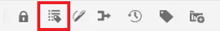

   De markeringen verschijnen binnen het onderwerp. Met de weergave Codes kunt u:

   - Selecteer de inhoud van een element door op de openingstag of de afsluitende tag te klikken.

   - U kunt tags uitvouwen of samenvouwen door op de +- of - -toets in de tag te klikken.

   - Gebruik het contextmenu om het geselecteerde element te knippen, te kopiëren of te passeren.

   - Sleep elementen door de tag te selecteren en het element op een geldige locatie neer te zetten.

2. Klik op de knop [!UICONTROL **Tags in-/uitschakelen**] weer om labels te verbergen.

Tags verdwijnen, zodat u zich op de tekst kunt concentreren.

## Elementen vergrendelen tijdens gebruik

Door een bestand te vergrendelen (of uit te checken) heeft de gebruiker exclusieve schrijftoegang tot het bestand. Wanneer het bestand is ontgrendeld (of is ingecheckt), worden de wijzigingen opgeslagen in de huidige versie van het bestand.

1. Klik op de knop [!UICONTROL **Vergrendelen**] op de secundaire werkbalk.

   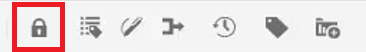

   Het bestand is uitgecheckt en er verschijnt een vergrendelingspictogram naast de bestandsnaam in de opslagplaats.

2. Klik op de knop [!UICONTROL **Ontgrendelen**] pictogram.

   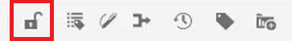

De Repository wordt bijgewerkt om aan te tonen dat het bestand is ingecheckt.

## Speciale tekens invoegen

1. Klik op de knop [!UICONTROL **Speciale tekens invoegen**] op de secundaire werkbalk.

   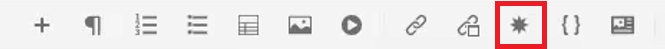

2. Typ in het dialoogvenster Speciaal teken invoegen de naam van het teken in de zoekbalk.

   U kunt ook het vervolgkeuzemenu Categorie selecteren gebruiken om alle tekens in een bepaalde categorie weer te geven.

3. Selecteer het gewenste teken.

4. Klikken [!UICONTROL **Invoegen**].

Het speciale teken wordt in de tekst ingevoegd.

## Schakelen tussen de modus Auteur, Bron en Voorvertoning

Met de werkbalk rechtsboven in het scherm kunt u schakelen tussen weergaven.

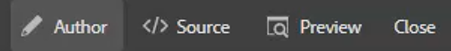

- Selecteren **Auteur** om de structuur en de inhoud weer te geven terwijl u met een onderwerp werkt.

- Selecteren **Bron** om onderliggende XML te tonen die omhoog het onderwerp maakt.

- Selecteren **Voorvertoning** om te tonen hoe een onderwerp wanneer bekeken door een gebruiker in hun browser zal tonen.

## Het thema wijzigen met Gebruikersvoorkeuren

U kunt kiezen uit de thema&#39;s Licht of Donker voor de editor. Met het thema Licht gebruiken de werkbalken en deelvensters een lichtgrijze achtergrond. Met het thema Donker gebruiken de werkbalken en deelvensters een zwarte achtergrond. In beide thema&#39;s wordt het bewerkingsgebied van de inhoud weergegeven met een witte achtergrond.

1. Klik op de knop [!UICONTROL **Gebruikersvoorkeuren**] op de bovenste werkbalk.

   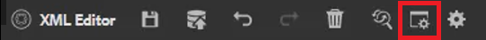

2. Klik in het dialoogvenster Gebruikersvoorkeuren op de knop [!UICONTROL **Thema**] vervolgkeuzelijst.

3. Kies een van de beschikbare opties.

   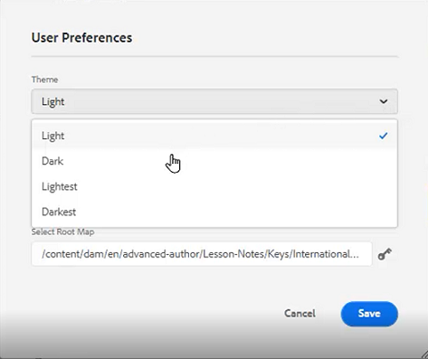

4. Klikken [!UICONTROL **Opslaan**].

De Editor wordt bijgewerkt om uw voorkeursthema weer te geven.

## Het basispad bijwerken met de gebruikersvoorkeuren

U kunt het Basispad bijwerken zodat in de weergave Opslagplaats de inhoud van een bepaalde locatie wordt weergegeven zodra u de Editor start. Hierdoor neemt de tijd voor toegang tot werkbestanden af.

1. Klik op de knop [!UICONTROL **Gebruikersvoorkeuren**] op de bovenste werkbalk.

   

2. Klik in het dialoogvenster Gebruikersvoorkeuren op de knop [!UICONTROL **Map**] naast het basispad.

   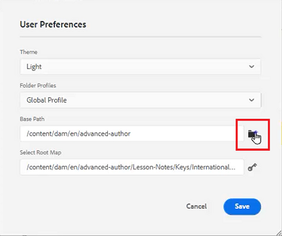

3. Klik in het dialoogvenster Pad selecteren op het selectievakje naast een specifieke map.

4. Klikken [!UICONTROL **Selecteren**].

De volgende keer dat u de Editor start, worden in de opslagplaats de bestanden weergegeven die zijn opgegeven in het basispad.

## Een nieuw mapprofiel toewijzen

Het algemene profiel is een systeemstandaard. Beheerders kunnen extra mapprofielen maken waaruit u kunt kiezen.

1. Klik op de knop [!UICONTROL **Gebruikersvoorkeuren**] op de bovenste werkbalk.

   

2. Klik in het dialoogvenster Gebruikersvoorkeuren op de knop [!UICONTROL **Mapprofielen**] vervolgkeuzelijst.

   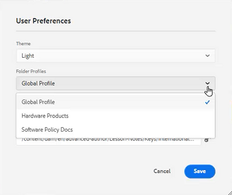

3. Kies een profiel in de beschikbare opties.

4. Klikken [!UICONTROL **Opslaan**].

Het nieuwe mapprofiel is nu toegewezen. De werkbalkopties, weergavemodi en Voorwaarden en Fragmenten zijn gewijzigd in het linkerdeelvenster. Het kan ook de visuele weergave van inhoud in de Editor wijzigen.

## Woordenboek wijzigen met Editor-instellingen

Editor-instellingen zijn beschikbaar voor gebruikers met beheerdersbevoegdheden. Met deze voorkeuren kunt u een reeks instellingen configureren, waaronder het woordenboek dat de Editor gebruikt voor de spellingcontrole.

1. Klik op de knop [!UICONTROL **Editor-instellingen**] op de bovenste werkbalk.

   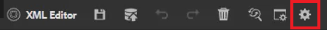

2. Klik in het dialoogvenster Editor-instellingen op de knop [!UICONTROL **Algemeen**] tab.

3. Selecteer het woordenboek waarmee u wilt werken.

4. Klikken [!UICONTROL **Opslaan**].

Het woordenboek wordt bijgewerkt. Door over te schakelen op AEM spellingcontrole kunt u een aangepaste woordenlijst gebruiken.

## Deelvensters weergeven en verbergen met Editor-instellingen

Een van de functies die u kunt aanpassen met de Editor-instellingen is Deelvensters. Meer bepaald kunt u selecteren welke deelvensters worden weergegeven of verborgen in de Editor.

1. Klik op de knop [!UICONTROL **Editor-instellingen**] op de bovenste werkbalk.

   

2. Klik in het dialoogvenster Editor-instellingen op de knop [!UICONTROL **Deelvensters**] tab.

3. Schakel de beschikbare deelvensters naar wens in of uit.

   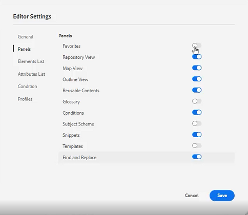

4. Klikken [!UICONTROL **Opslaan**].

Het linkerdeelvenster is nu zo geconfigureerd dat alleen de deelvensters worden weergegeven die in- en uitgeschakeld zijn.

## Naam- en labelelementen in Editor-instellingen

In de Elements List kunt u een specifiek element een naam geven en er een mensvriendelijker label aan toewijzen. De elementnaam moet een van de DITA-elementen zijn. Het label kan elke tekenreeks zijn.

1. Klik op de knop [!UICONTROL **Editor-instellingen**] op de bovenste werkbalk.

   

2. Klik in het dialoogvenster Editor-instellingen op de knop [!UICONTROL **Elements List**] tab.

3. Typ een **Elementnaam** en **Label** op de respectieve velden.

4. Klik op de knop [!UICONTROL **Plus**] om meer elementen aan de lijst toe te voegen.

   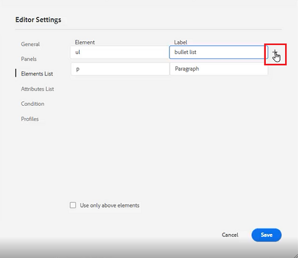

5. Klikken [!UICONTROL **Opslaan**].

U kunt de wijziging in de Elements-lijst direct zien in de bestaande tags in de Editor. U kunt ze ook zien in de opties die worden geboden wanneer u een nieuw element toevoegt.

## Naam- en labelkenmerken in Editor-instellingen

De lijst met kenmerken werkt ongeveer op dezelfde manier als de lijst met elementen. Vanuit de instellingen van de Editor kunt u de Lijst met kenmerken en hun weergavenamen bepalen.

1. Klik op de knop [!UICONTROL **Editor-instellingen**] op de bovenste werkbalk.

   

2. Klik in het dialoogvenster Editor-instellingen op de knop [!UICONTROL **Lijst met kenmerken**] tab.

3. Typ een **Kenmerknaam** en **Label** op de respectieve velden.

4. Klik op de knop [!UICONTROL **Plus**] om meer kenmerken aan de lijst toe te voegen.

## Voorwaarden configureren in Editor-instellingen

Op het tabblad Voorwaarde kunt u verschillende eigenschappen configureren.

1. Klik op de knop [!UICONTROL **Editor-instellingen**] op de bovenste werkbalk.

   

2. Klik in het dialoogvenster Editor-instellingen op de knop [!UICONTROL **Voorwaarde**] tab.

3. Schakel de selectievakjes in voor de voorwaarden die u wilt toepassen.

   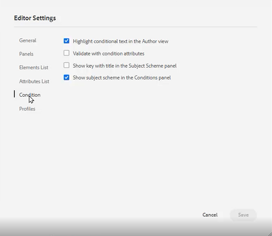

4. Klikken [!UICONTROL **Opslaan**].

## Een publicatieprofiel maken in de Editor-instellingen

Publicatieprofielen kunnen worden gebruikt om de kennisbasis te publiceren. Salesforce gebruikt bijvoorbeeld een geconfigureerde app met een consumentensleutel en een consumentengeheim. Deze informatie kan worden gebruikt om een Salesforce-publicatieprofiel te maken.

1. Klik op de knop [!UICONTROL **Editor-instellingen**] op de bovenste werkbalk.

   

2. Klik in het dialoogvenster Editor-instellingen op de knop [!UICONTROL **Profielen**] tab.

3. Klik op de knop [!UICONTROL **Plus**] pictogram naast Profielen.

4. Vul de velden naar wens in.

5. Klikken [!UICONTROL **Opslaan**].

Er is een publicatieprofiel gemaakt.
